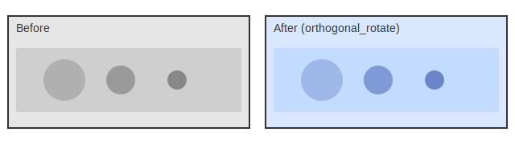
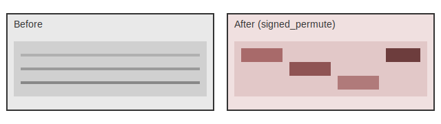

# Skoogeer-Noise

A ComfyUI custom node pack for latent/image/conditioning perturbations and diagnostics.

## Overview

- Spatial perturbations (mesh drag warps) for `LATENT` and `IMAGE`.
- Seeded Gaussian noise utilities for `LATENT`, `IMAGE`, and `CONDITIONING`.
- Procedural / structured noise generators (Perlin, Simplex, Worley, reaction-diffusion, fBm, swirl).
- Low/high frequency split helpers for `LATENT` and `CONDITIONING`.
- Latent diagnostics preview nodes.

This pack was extracted from `ComfyUI-FlowMatching-Upscaler` and also includes the latent/image/conditioning noise + filtering nodes that were previously shipped in `ComfyUI-QwenRectifiedFlowInverter`.

## Contents

- [Overview](#overview)
- [Installation](#installation)
- [Quick Start](#quick-start)
- [Concepts](#concepts)
  - [Data Types / Shapes](#data-types--shapes)
  - [Parameter Conventions](#parameter-conventions)
  - [Selection Modes](#selection-modes)
  - [Flux.2 Patchification](#flux2-patchification)
- [Node Reference](#node-reference)
  - [Node Index](#node-index)
  - [Spatial Perturbations](#spatial-perturbations)
  - [Seeded Noise](#seeded-noise)
  - [Utilities and Debug](#utilities-and-debug)
  - [Channel Transforms](#channel-transforms)
  - [Frequency Filtering](#frequency-filtering)
  - [Procedural Noise](#procedural-noise)
  - [Flux Tools](#flux-tools)
  - [Conditioning Tools](#conditioning-tools)
- [Examples Gallery](#examples-gallery)
- [Development](#development)

## Installation

1. Clone into `ComfyUI/custom_nodes/Skoogeer-Noise`
2. Restart ComfyUI

Dependencies: `torch`, `numpy`, and `einops` (ComfyUI typically already includes torch/numpy).

## Quick Start

Workflow sketch (SD-style latents):

```
Latent -> Latent Channel Linear Transform (operation=orthogonal_rotate, selection_mode=top_roughness, selection_fraction=0.25, mix=0.6)
      -> Latent Swirl Noise (vortices=3, strength=0.8, mix=0.5)
      -> VAE Decode
```

Flux.2 latents (patchified) should wrap latent-space ops:

```
Unpatchify Flux.2 Latent -> (your latent ops) -> Patchify Flux.2 Latent
```

Tips:

- Use `mask` to localize effects.
- Lower `mix` for subtle edits.
- Pair `Latent Channel Stats Preview` to inspect channel shifts.

## Concepts

### Data Types / Shapes

#### `LATENT`

ComfyUI latents are dictionaries containing a `"samples"` tensor.

- Most SD-style latents: `(B, C, H, W)`
- Some video / flow-matching latents: `(B, C, T, H, W)`

All latent nodes in this pack operate on `latent["samples"]` and preserve other latent dict keys. Most latent nodes accept an optional `mask` input; when provided, the mask is resized to latent resolution (bicubic when downscaling) and the effect is applied only within the mask. `Latent Mesh Drag` also warps `latent["noise_mask"]` when present.

#### `IMAGE`

ComfyUI images are torch tensors in **BHWC** format: `(B, H, W, C)` (usually `C=3`). Some nodes also accept 5D "video" tensors: `(B, T, H, W, C)`.

Image noise nodes accept an optional `mask` input; when provided, the mask is resized to the image resolution (bicubic when downscaling) and the effect is applied only within the mask.

#### `CONDITIONING`

ComfyUI conditioning is a list of `[embedding, metadata]` entries. The conditioning nodes in this pack operate on:

- the embedding tensor (commonly shaped like `(tokens, features)` or `(B, tokens, features)`), and
- `metadata["pooled_output"]` when present.

### Parameter Conventions

- **Seed (`seed`)**: 64-bit integer used to make perturbations repeatable.
- **Strength (`strength`)**: unless stated otherwise, noise nodes scale their generated pattern by the **standard deviation of the input** (per-sample).
- **Channel mode (`channel_mode`)**:
  - `shared`: reuse one generated field for all channels
  - `per_channel`: reseed and generate per channel
- **Temporal mode (`temporal_mode`)** (5D tensors only):
  - `locked`: reuse one pattern across frames (temporally stable)
  - `animated`: reseed per frame (more variation, can flicker)

#### Common Parameters

| Parameter | Meaning | Notes |
|-----------|---------|-------|
| `seed` | 64-bit integer for repeatable randomness. | When present, it drives deterministic sampling. |
| `strength` | Scales noise relative to the input's standard deviation. | Unless a node defines strength differently. |
| `channel_mode` | Controls whether noise is shared or per-channel. | `shared` reuses one field, `per_channel` reseeds per channel. |
| `temporal_mode` | Controls temporal consistency for 5D tensors. | `locked` is stable, `animated` reseeds per frame. |
| `mix` | Blends original and modified outputs. | `0` = original, `1` = full effect. |
| `mask` | Optional mask limiting the effect. | Resized to target resolution. |

When node tables list these parameters, the Notes column may say "See Common Parameters."

### Selection Modes

- `all`: apply to every channel.
- `random`: choose a random subset per sample using `seed`.
- `top_variance`: choose channels with the highest spatial variance (usually the most active features).
- `top_roughness`: choose channels with the highest mean gradient magnitude (often texture/fine detail carriers).
- `indices`: use the explicit channel list in `selection_indices`.
- `selection_order`: pick `highest` or `lowest` when using `top_variance`/`top_roughness` (low values tend to affect smoother, structural channels).
- `selection_count` overrides `selection_fraction` when `> 0`.

### Flux.2 Patchification

Flux.2 VAEs patchify 2x2 at the final downscale step, producing 128-channel latents at 1/16 spatial resolution. Our latent noise nodes operate on spatial neighborhoods, so applying them directly to patchified latents can introduce 2x2 block artifacts and incorrect spatial correlations. Use `Unpatchify Flux.2 Latent` before running latent noise nodes, then `Patchify Flux.2 Latent` afterward to return to the standard Flux.2 format.

## Node Reference

### Node Index

| Node | Category | Output(s) |
|------|----------|-----------|
| [Latent Mesh Drag](#latent-mesh-drag) | `latent/perturb` | `LATENT` |
| [Image Mesh Drag](#image-mesh-drag) | `image/perturb` | `IMAGE` |
| [Fluid Latent Advection](#fluid-latent-advection) | `latent/perturb` | `LATENT`, `IMAGE` |
| [Fluid Image Advection](#fluid-image-advection) | `image/perturb` | `IMAGE`, `IMAGE` |
| [Latent Smoke Simulation](#latent-smoke-simulation) | `latent/perturb` | `LATENT`, `IMAGE`, `IMAGE` |
| [Image Smoke Simulation](#image-smoke-simulation) | `image/perturb` | `IMAGE`, `IMAGE`, `IMAGE` |
| [Latent Noise](#latent-noise) | `latent/perturb` | `LATENT` |
| [Image Noise](#image-noise) | `image/perturb` | `IMAGE` |
| [Latent to Image](#latent-to-image) | `latent/debug` | `IMAGE` |
| [Latent Channel Stats Preview](#latent-channel-stats-preview) | `latent/debug` | `IMAGE` |
| [Latent Channel Linear Transform](#latent-channel-linear-transform) | `latent/channel` | `LATENT` |
| [Latent Channel Nonlinear Transform](#latent-channel-nonlinear-transform) | `latent/channel` | `LATENT` |
| [Latent Packed Slot Transform](#latent-packed-slot-transform) | `latent/channel` | `LATENT` |
| [Latent Gaussian Blur](#latent-gaussian-blur) | `Latent/Filter` | `LATENT` |
| [Latent Frequency Split](#latent-frequency-split) | `Latent/Filter` | `LATENT` (low), `LATENT` (high) |
| [Latent Frequency Merge](#latent-frequency-merge) | `Latent/Filter` | `LATENT` |
| [Add Latent Noise (Seeded)](#add-latent-noise-seeded) | `Latent/Noise` | `LATENT` |
| [Add Image Noise (Seeded)](#add-image-noise-seeded) | `Image/Noise` | `IMAGE` |
| [Latent Perlin Fractal Noise](#latent-perlin-fractal-noise) | `Latent/Noise` | `LATENT` |
| [Image Perlin Fractal Noise](#image-perlin-fractal-noise) | `Image/Noise` | `IMAGE` |
| [Latent Simplex Noise](#latent-simplex-noise) | `Latent/Noise` | `LATENT` |
| [Image Simplex Noise](#image-simplex-noise) | `Image/Noise` | `IMAGE` |
| [Latent Worley Noise](#latent-worley-noise) | `Latent/Noise` | `LATENT` |
| [Image Worley Noise](#image-worley-noise) | `Image/Noise` | `IMAGE` |
| [Latent Reaction-Diffusion](#latent-reaction-diffusion) | `Latent/Noise` | `LATENT` |
| [Image Reaction-Diffusion](#image-reaction-diffusion) | `Image/Noise` | `IMAGE` |
| [Latent Fractal Brownian Motion](#latent-fractal-brownian-motion) | `Latent/Noise` | `LATENT` |
| [Image Fractal Brownian Motion](#image-fractal-brownian-motion) | `Image/Noise` | `IMAGE` |
| [Latent Swirl Noise](#latent-swirl-noise) | `Latent/Noise` | `LATENT` |
| [Image Swirl Noise](#image-swirl-noise) | `Image/Noise` | `IMAGE` |
| [Forward Diffusion (Add Scheduled Noise)](#forward-diffusion-add-scheduled-noise) | `Latent/Noise` | `LATENT` |
| [Unpatchify Flux.2 Latent](#unpatchify-flux2-latent) | `Latent/Flux` | `LATENT` |
| [Patchify Flux.2 Latent](#patchify-flux2-latent) | `Latent/Flux` | `LATENT` |
| [Conditioning (Add Noise)](#conditioning-add-noise) | `conditioning/noise` | `CONDITIONING` |
| [Conditioning (Gaussian Blur)](#conditioning-gaussian-blur) | `conditioning/filter` | `CONDITIONING` |
| [Conditioning (Frequency Split)](#conditioning-frequency-split) | `conditioning/filter` | `CONDITIONING` (low), `CONDITIONING` (high) |
| [Conditioning (Frequency Merge)](#conditioning-frequency-merge) | `conditioning/filter` | `CONDITIONING` |
| [Conditioning (Scale)](#conditioning-scale) | `conditioning/filter` | `CONDITIONING` |

### Spatial Perturbations

#### Latent Mesh Drag

Applies a cloth-like spatial warp to a `LATENT` by randomly dragging control vertices on a coarse mesh and interpolating a smooth displacement field.

- **Menu category:** `latent/perturb`
- **Returns:** `LATENT`

##### Inputs

| Field | Type | Default | Range/Options | Notes |
|------|------|---------|--------------|------|
| `latent` | `LATENT` | – | – | Latent to warp spatially using a random mesh drag. |
| `mask` | `MASK` | – | – | Optional mask to limit the warp to masked areas. The mask is resized to latent resolution (bicubic when downscaling). |
| `seed` | `INT` | `0` | `0..2^64-1` | Seed controlling which mesh points are dragged and by how much. |
| `points` | `INT` | `12` | `0..2048` | Number of mesh vertices to randomly drag. |
| `drag_min` | `FLOAT` | `0.0` | `0.0..128.0` | Minimum drag distance (**latent pixels**). |
| `drag_max` | `FLOAT` | `4.0` | `0.0..128.0` | Maximum drag distance (**latent pixels**). |
| `direction` | `FLOAT` | `-1.0` | `-1.0..360.0` | Drag direction in degrees (`0`=up, `90`=right, `180`=down, `270`=left). `-1` allows random directions. |
| `stroke_width` | `FLOAT` | `-1.0` | `-1.0..4096.0` | When `>0`, limits the warp to narrow brush-stroke channels aligned with the direction (one per dragged mesh point; when `direction>=0`, stroke centers are jittered so they aren't grid-aligned). Units are **latent pixels**. `-1` disables. |
| `displacement_interpolation` | enum | `bicubic` | `bilinear/bicubic/bspline/nearest` | How to interpolate sparse mesh drags into a full displacement field (`bspline` is smoother). |
| `spline_passes` | `INT` | `2` | `0..16` | Only used when `displacement_interpolation = bspline`. |
| `sampling_interpolation` | enum | `bilinear` | `bilinear/bicubic/nearest` | How to sample the source tensor when applying the warp. |

##### Notes

- Drag distances are specified in **latent pixels** (multiply by ~8 for image-space pixels with SD-style VAEs).
- If a `mask` is supplied, the warp is applied only in the masked area (and the mask is resized to latent resolution).
- If the input latent contains a `noise_mask` tensor, it is warped using the same displacement (and respects the `mask` when provided).

---

#### Image Mesh Drag

Applies the same mesh-drag deformation in image space (pixel units) to ComfyUI `IMAGE` tensors.

- **Menu category:** `image/perturb`
- **Returns:** `IMAGE`

##### Inputs

| Field | Type | Default | Range/Options | Notes |
|------|------|---------|--------------|------|
| `image` | `IMAGE` | – | – | Image to warp spatially using a random mesh drag. |
| `seed` | `INT` | `0` | `0..2^64-1` | Seed controlling which mesh points are dragged and by how much. |
| `points` | `INT` | `12` | `0..4096` | Number of mesh vertices to randomly drag. |
| `drag_min` | `FLOAT` | `0.0` | `0.0..4096.0` | Minimum drag distance (**image pixels**). |
| `drag_max` | `FLOAT` | `32.0` | `0.0..4096.0` | Maximum drag distance (**image pixels**). |
| `direction` | `FLOAT` | `-1.0` | `-1.0..360.0` | Drag direction in degrees (`0`=up, `90`=right, `180`=down, `270`=left). `-1` allows random directions. |
| `stroke_width` | `FLOAT` | `-1.0` | `-1.0..16384.0` | When `>0`, limits the warp to narrow brush-stroke channels aligned with the direction (one per dragged mesh point; when `direction>=0`, stroke centers are jittered so they aren't grid-aligned). Units are **image pixels**. `-1` disables. |
| `displacement_interpolation` | enum | `bicubic` | `bilinear/bicubic/bspline/nearest` | How to interpolate sparse mesh drags into a full displacement field (`bspline` is smoother). |
| `spline_passes` | `INT` | `2` | `0..16` | Only used when `displacement_interpolation = bspline`. |
| `sampling_interpolation` | enum | `bilinear` | `bilinear/bicubic/nearest` | How to sample the source image when applying the warp. |

---

#### Fluid Latent Advection

Advects latent channels through a viscous velocity field and returns a velocity preview image.

- **Menu category:** `latent/perturb`
- **Returns:** `LATENT`, `IMAGE`

##### Inputs

See `docs/fluid-simulation.md` for the full parameter list (shared with the image variant). Core controls include `steps`, `dt`, `resolution_scale`, force injection settings, `vorticity`, and `wrap_mode`.

##### Notes

- Optional `mask` limits the effect to masked areas.

---

#### Fluid Image Advection

Distorts an image by advecting pixels through a viscous velocity field and returns a velocity preview image.

- **Menu category:** `image/perturb`
- **Returns:** `IMAGE`, `IMAGE`

##### Inputs

See `docs/fluid-simulation.md` for the full parameter list (shared with the latent variant). Core controls include `steps`, `dt`, `resolution_scale`, force injection settings, `vorticity`, and `wrap_mode`.

##### Notes

- Optional `mask` limits the effect to masked areas.

---

#### Latent Smoke Simulation

Simulates buoyancy-driven smoke in latent space and returns density and velocity previews.

- **Menu category:** `latent/perturb`
- **Returns:** `LATENT`, `IMAGE`, `IMAGE`

##### Inputs

See `docs/fluid-simulation.md` for smoke-mode parameters such as `smoke_source_mode`, `buoyancy`, `cooling`, and output batching controls.

---

#### Image Smoke Simulation

Simulates buoyancy-driven smoke in image space and returns density and velocity previews.

- **Menu category:** `image/perturb`
- **Returns:** `IMAGE`, `IMAGE`, `IMAGE`

##### Inputs

See `docs/fluid-simulation.md` for smoke-mode parameters such as `smoke_source_mode`, `buoyancy`, `cooling`, and output batching controls.

---

### Seeded Noise

#### Latent Noise

Adds **seeded Gaussian noise** to a ComfyUI `LATENT` dictionary.

- **Menu category:** `latent/perturb`
- **Returns:** `LATENT`

##### Inputs

| Field | Type | Default | Range/Options | Notes |
|------|------|---------|--------------|------|
| `latent` | `LATENT` | – | – | Latent to receive additional Gaussian noise. |
| `seed` | `INT` | `0` | `0..2^64-1` | See Common Parameters. |
| `strength` | `FLOAT` | `1.0` | `0.0..10.0` | See Common Parameters. |

---

#### Image Noise

Adds **seeded Gaussian noise** to a ComfyUI `IMAGE` tensor.

- **Menu category:** `image/perturb`
- **Returns:** `IMAGE`

##### Inputs

| Field | Type | Default | Range/Options | Notes |
|------|------|---------|--------------|------|
| `image` | `IMAGE` | – | – | Image to receive additional Gaussian noise. |
| `seed` | `INT` | `0` | `0..2^64-1` | See Common Parameters. |
| `strength` | `FLOAT` | `1.0` | `0.0..10.0` | See Common Parameters. |

---

### Utilities and Debug

#### Latent to Image

Converts each latent channel into its own grayscale image and batches the results.

- **Menu category:** `latent/debug`
- **Returns:** `IMAGE`

##### Inputs

| Field | Type | Default | Range/Options | Notes |
|------|------|---------|--------------|------|
| `latent` | `LATENT` | – | – | Latent to render into per-channel grayscale images. |
| `normalize` | `BOOLEAN` | `false` | – | If true, per-image min/max normalization maps values into `[0,1]`. |
| `output_channels` | enum | `3` | `1/3` | Use `3` to repeat grayscale into RGB for PreviewImage compatibility; output shape is `(B*C, H, W, C)`. |

---

#### Latent Channel Stats Preview

Renders a bar-chart preview of **per-channel mean and standard deviation** for `LATENT["samples"]`.

- **Menu category:** `latent/debug`
- **Returns:** `IMAGE`

##### Inputs

| Field | Type | Default | Range/Options | Notes |
|------|------|---------|--------------|------|
| `latent` | `LATENT` | – | – | Latent to analyze. |
| `channel_limit` | `INT` | `16` | `1..64` | Number of channels to display. |
| `height` | `INT` | `256` | `72..1024` | Output image height (layout adjusts automatically). |

---

### Channel Transforms

#### Latent Channel Linear Transform

Applies **linear channel-space transforms** (signed permutations, orthogonal rotations, Householder reflections, low-rank shears).

- **Menu category:** `latent/channel`
- **Returns:** `LATENT`

##### Inputs

| Field | Type | Default | Range/Options | Notes |
|------|------|---------|--------------|------|
| `latent` | `LATENT` | – | – | Latent to transform in channel-space. |
| `operation` | enum | `signed_permute` | `signed_permute/orthogonal_rotate/householder_reflect/low_rank_shear` | Linear transform to apply. |
| `seed` | `INT` | `0` | `0..2^64-1` | Seed for deterministic selection/transforms. |
| `sign_flip_prob` | `FLOAT` | `0.5` | `0.0..1.0` | Sign-flip probability for signed permutations. |
| `tile_size` | `INT` | `0` | `0..512` | Tile size (latent pixels) for per-tile permutations. |
| `block_size` | `INT` | `0` | `0..4096` | Channels per orthogonal block (`0` = full). |
| `alpha` | `FLOAT` | `0.5` | `-4.0..4.0` | Shear strength for low-rank shear. |
| `selection_mode` | enum | `all` | `all/random/top_variance/top_roughness/indices` | Channel selection strategy. |
| `selection_fraction` | `FLOAT` | `1.0` | `0.0..1.0` | Fraction of channels when `selection_count=0`. |
| `selection_count` | `INT` | `0` | `0..4096` | Exact number of channels (overrides fraction). |
| `selection_order` | enum | `highest` | `highest/lowest` | Choose high or low variance/roughness. |
| `selection_indices` | `STRING` | `""` | – | Comma-separated indices when `selection_mode=indices`. |
| `mix` | `FLOAT` | `1.0` | `0.0..1.0` | See Common Parameters. |
| `match_stats` | `BOOLEAN` | `false` | – | Match per-channel mean/std after edit. |
| `mask` | `MASK` | – | – | Optional mask to limit the transform. |

##### Mode behavior + impact

| Mode | What it does | Likely impact |
|------|--------------|---------------|
| `signed_permute` | Reorders selected channels; optional sign flips keep norms but remap the feature basis. | Hard, crunchy remaps and codec-like glitches that often retain overall structure. |
| `orthogonal_rotate` | Globally mixes channels via an orthogonal rotation (energy-preserving). | Smooth “style drift” shifts in material/texture without tearing; more coherent than permutation. |
| `householder_reflect` | Reflects along a random feature direction (single hyperplane flip). | Inversion-like feature accents; can feel like latent “photonegative” or specular inversions. |
| `low_rank_shear` | Rank‑1 update: measure along one direction and add along another. | Feature feedback / resonance; can create blooming or melting effects without total scramble. |

---

#### Latent Channel Nonlinear Transform

Applies **nonlinear channel-space transforms** (gating, quantization, clipping, dropout/replacement).

- **Menu category:** `latent/channel`
- **Returns:** `LATENT`

##### Inputs

| Field | Type | Default | Range/Options | Notes |
|------|------|---------|--------------|------|
| `latent` | `LATENT` | – | – | Latent to transform in channel-space. |
| `operation` | enum | `gate_multiply` | `gate_multiply/gate_add/quantize/clip_hard/clip_soft/dropout_zero/dropout_noise/dropout_swap` | Nonlinear transform to apply. |
| `seed` | `INT` | `0` | `0..2^64-1` | Seed for deterministic gating/dropout. |
| `gate_strength` | `FLOAT` | `1.0` | `0.0..10.0` | Gate slope (gate_* operations). |
| `beta` | `FLOAT` | `1.0` | `-4.0..4.0` | Gate scale (gate_* operations). |
| `blur_radius` | `INT` | `0` | `0..64` | Blur radius for gate maps (latent pixels). |
| `quantize_step` | `FLOAT` | `0.25` | `0.0..10.0` | Step size for quantization. |
| `clip_threshold` | `FLOAT` | `2.0` | `0.0..10.0` | Threshold for clipping. |
| `selection_mode` | enum | `all` | `all/random/top_variance/top_roughness/indices` | Channel selection strategy. |
| `selection_fraction` | `FLOAT` | `1.0` | `0.0..1.0` | Fraction of channels when `selection_count=0`. |
| `selection_count` | `INT` | `0` | `0..4096` | Exact number of channels (overrides fraction). |
| `selection_order` | enum | `highest` | `highest/lowest` | Choose high or low variance/roughness. |
| `selection_indices` | `STRING` | `""` | – | Comma-separated indices when `selection_mode=indices`. |
| `mix` | `FLOAT` | `1.0` | `0.0..1.0` | See Common Parameters. |
| `match_stats` | `BOOLEAN` | `false` | – | Match per-channel mean/std after edit. |
| `mask` | `MASK` | – | – | Optional mask to limit the transform. |

##### Mode behavior + impact

| Mode | What it does | Likely impact |
|------|--------------|---------------|
| `gate_multiply` | Builds a per‑pixel gate from a random projection and multiplies channels by it. | Self‑amplifying/suppressing regions; “alive” glitches that track existing structure. |
| `gate_add` | Computes a gate and adds a gated feature direction back into channels. | Content‑dependent bias; can create halos, embossed edges, or resonant highlights. |
| `quantize` | Rounds values to a fixed step size. | Posterized, crunchy textures; flatter gradients and vector‑art vibe. |
| `clip_hard` | Hard clamps values to `[-t, t]`. | Removes sharp spikes; can flatten detail and yield plasticky surfaces. |
| `clip_soft` | Soft clamps with `tanh` at threshold `t`. | Gentler compression; dreamy/flattened details without abrupt clipping. |
| `dropout_zero` | Zeros selected channels. | Missing‑feature hallucinations; sudden structure loss and glitch gaps. |
| `dropout_noise` | Replaces channels with mean/std‑matched noise. | Grainy, unstable textures while keeping channel statistics stable. |
| `dropout_swap` | Swaps selected channels with other random channels. | Channel cross‑talk artifacts; can look like latent “miswiring.” |

---

#### Latent Packed Slot Transform

Applies **slot-level operations** to packed (space-to-depth) latents by permuting/rotating the `P x P` slots inside the channel dimension.

- **Menu category:** `latent/channel`
- **Returns:** `LATENT`

##### Inputs

| Field | Type | Default | Range/Options | Notes |
|------|------|---------|--------------|------|
| `latent` | `LATENT` | – | – | Packed latent to transform per slot. |
| `operation` | enum | `shuffle` | `shuffle/rotate_cw/rotate_ccw/flip_h/flip_v` | Slot operation to apply. |
| `patch_size` | `INT` | `2` | `1..8` | Patch size `P` for `P x P` slot layout. |
| `base_channels` | `INT` | `0` | `0..4096` | Base channels before packing (`0` = infer). |
| `seed` | `INT` | `0` | `0..2^64-1` | Seed for slot shuffles. |
| `mix` | `FLOAT` | `1.0` | `0.0..1.0` | See Common Parameters. |
| `match_stats` | `BOOLEAN` | `false` | – | Match per-channel mean/std after edit. |
| `mask` | `MASK` | – | – | Optional mask to limit the transform. |

##### Mode behavior + impact

| Mode | What it does | Likely impact |
|------|--------------|---------------|
| `shuffle` | Randomly permutes the `P x P` slot ordering within each base channel. | Digital macro‑blocking, moiré‑like micro‑shifts, checkerboard artifacts. |
| `rotate_cw` | Rotates the slot grid clockwise (90 degrees). | Directional slot shifts; subtle “micro‑rotation” with structured aliasing. |
| `rotate_ccw` | Rotates the slot grid counterclockwise (90 degrees). | Same as rotate_cw but in opposite direction; can pair for oscillation. |
| `flip_h` | Flips slots left‑right. | Mirrored slot patterns; can cause chromatic‑aberration‑like shifts. |
| `flip_v` | Flips slots top‑bottom. | Vertical slot mirroring; structured digital shimmer. |

---

### Frequency Filtering

#### Latent Gaussian Blur

Gaussian blur for latents (supports both 4D and 5D latents).

- **Menu category:** `Latent/Filter`
- **Returns:** `LATENT`

##### Inputs

| Field | Type | Default | Range/Options | Notes |
|------|------|---------|--------------|------|
| `latent` | `LATENT` | – | – | Latent tensor to blur. |
| `sigma` | `FLOAT` | `1.0` | `0.0..10.0` | Standard deviation for the Gaussian kernel. `0` is a no-op. |
| `blur_mode` | enum | `Spatial Only` | `Spatial Only/Spatial and Channel` | When `Spatial and Channel`, also blurs across the channel dimension. |

---

#### Latent Frequency Split

Splits a latent into **low-pass** and **high-pass** bands by subtracting a Gaussian-smoothed version.

- **Menu category:** `Latent/Filter`
- **Returns:** `LATENT` (low), `LATENT` (high)

##### Inputs

| Field | Type | Default | Range/Options | Notes |
|------|------|---------|--------------|------|
| `latent` | `LATENT` | – | – | Latent to decompose into low/high frequency bands. |
| `sigma` | `FLOAT` | `1.5` | `0.0..20.0` | Radius of Gaussian low-pass. Higher moves more detail into the high band. |

##### Outputs

- `low_pass`: blurred latent
- `high_pass`: `latent - low_pass` (zeros when `sigma <= 0`)

---

#### Latent Frequency Merge

Merges the **low-pass** and **high-pass** bands back into a single latent.

- **Menu category:** `Latent/Filter`
- **Returns:** `LATENT`

##### Inputs

| Field | Type | Default | Range/Options | Notes |
|------|------|---------|--------------|------|
| `low_pass` | `LATENT` | – | – | Low-frequency latent band produced by `Latent Frequency Split`. |
| `high_pass` | `LATENT` | – | – | High-frequency latent band to merge back in. |
| `low_gain` | `FLOAT` | `1.0` | `-5.0..5.0` | Multiplier for the low-pass band before merging. |
| `high_gain` | `FLOAT` | `1.0` | `-5.0..5.0` | Multiplier for the high-pass band before merging. |

##### Output

- `merged`: `low_pass * low_gain + high_pass * high_gain`

---

### Procedural Noise

#### Add Latent Noise (Seeded)

Adds seeded Gaussian noise to `LATENT["samples"]` (strength is relative to the latent's standard deviation).

- **Menu category:** `Latent/Noise`
- **Returns:** `LATENT`

##### Inputs

| Field | Type | Default | Range/Options | Notes |
|------|------|---------|--------------|------|
| `latent` | `LATENT` | – | – | Latent to receive additional Gaussian noise. |
| `seed` | `INT` | `0` | `0..2^64-1` | See Common Parameters. |
| `strength` | `FLOAT` | `1.0` | `0.0..10.0` | `1.0` adds noise with roughly the same std as the latent. |

---

#### Add Image Noise (Seeded)

Adds seeded Gaussian noise to an `IMAGE` tensor (strength is relative to the image's standard deviation).

- **Menu category:** `Image/Noise`
- **Returns:** `IMAGE`

##### Inputs

| Field | Type | Default | Range/Options | Notes |
|------|------|---------|--------------|------|
| `image` | `IMAGE` | – | – | Image to receive additional Gaussian noise. |
| `seed` | `INT` | `0` | `0..2^64-1` | See Common Parameters. |
| `strength` | `FLOAT` | `1.0` | `0.0..10.0` | `1.0` adds noise with roughly the same std as the image. |

---

#### Latent Perlin Fractal Noise

Adds smooth **fractal Perlin noise** to a latent for structured variation.

- **Menu category:** `Latent/Noise`
- **Returns:** `LATENT`

##### Inputs

| Field | Type | Default | Range/Options | Notes |
|------|------|---------|--------------|------|
| `latent` | `LATENT` | – | – | Latent that will be perturbed with fractal Perlin noise. |
| `seed` | `INT` | `0` | `0..2^64-1` | Seed controlling the procedural noise pattern. |
| `frequency` | `FLOAT` | `2.0` | `0.01..64.0` | Base lattice frequency (higher = finer detail). |
| `octaves` | `INT` | `4` | `1..12` | Number of noise layers to accumulate. |
| `persistence` | `FLOAT` | `0.5` | `0.0..1.0` | Amplitude multiplier between octaves. |
| `lacunarity` | `FLOAT` | `2.0` | `1.0..6.0` | Frequency multiplier between octaves. |
| `strength` | `FLOAT` | `0.5` | `0.0..5.0` | Scales normalized noise relative to the latent's standard deviation. |
| `channel_mode` | enum | `shared` | `shared/per_channel` | See Common Parameters. |

##### Notes

- For 5D latents `(B,C,T,H,W)`, this node generates **3D Perlin noise** across `(T,H,W)` (no `temporal_mode` parameter).

---

#### Image Perlin Fractal Noise

Adds smooth **fractal Perlin noise** to an image for structured variation.

- **Menu category:** `Image/Noise`
- **Returns:** `IMAGE`

##### Inputs

| Field | Type | Default | Range/Options | Notes |
|------|------|---------|--------------|------|
| `image` | `IMAGE` | – | – | Image that will be perturbed with fractal Perlin noise. |
| `seed` | `INT` | `0` | `0..2^64-1` | Seed controlling the procedural noise pattern. |
| `frequency` | `FLOAT` | `2.0` | `0.01..64.0` | Base lattice frequency (higher = finer detail). |
| `octaves` | `INT` | `4` | `1..12` | Number of noise layers to accumulate. |
| `persistence` | `FLOAT` | `0.5` | `0.0..1.0` | Amplitude multiplier between octaves. |
| `lacunarity` | `FLOAT` | `2.0` | `1.0..6.0` | Frequency multiplier between octaves. |
| `strength` | `FLOAT` | `0.5` | `0.0..5.0` | Scales normalized noise relative to the image's standard deviation. |
| `channel_mode` | enum | `shared` | `shared/per_channel` | See Common Parameters. |
| `temporal_mode` | enum | `locked` | `locked/animated` | See Common Parameters. |

---

#### Latent Simplex Noise

Adds layered **fractal simplex noise** to a latent for organic perturbations.

- **Menu category:** `Latent/Noise`
- **Returns:** `LATENT`

##### Inputs

| Field | Type | Default | Range/Options | Notes |
|------|------|---------|--------------|------|
| `latent` | `LATENT` | – | – | Latent to perturb with simplex noise. |
| `seed` | `INT` | `0` | `0..2^64-1` | Seed controlling the simplex lattice offsets. |
| `frequency` | `FLOAT` | `2.0` | `0.01..64.0` | Base lattice frequency for the simplex grid. |
| `octaves` | `INT` | `4` | `1..12` | Number of simplex layers to accumulate. |
| `persistence` | `FLOAT` | `0.5` | `0.0..1.0` | Amplitude multiplier applied between octaves. |
| `lacunarity` | `FLOAT` | `2.0` | `1.0..6.0` | Frequency multiplier applied between octaves. |
| `strength` | `FLOAT` | `0.5` | `0.0..5.0` | Scales normalized simplex noise relative to the latent's standard deviation. |
| `channel_mode` | enum | `shared` | `shared/per_channel` | See Common Parameters. |
| `temporal_mode` | enum | `locked` | `locked/animated` | See Common Parameters. |

---

#### Image Simplex Noise

Adds layered **fractal simplex noise** to an image.

- **Menu category:** `Image/Noise`
- **Returns:** `IMAGE`

##### Inputs

| Field | Type | Default | Range/Options | Notes |
|------|------|---------|--------------|------|
| `image` | `IMAGE` | – | – | Image to perturb with simplex noise. |
| `seed` | `INT` | `0` | `0..2^64-1` | Seed controlling the simplex lattice offsets. |
| `frequency` | `FLOAT` | `2.0` | `0.01..64.0` | Base lattice frequency for the simplex grid. |
| `octaves` | `INT` | `4` | `1..12` | Number of simplex layers to accumulate. |
| `persistence` | `FLOAT` | `0.5` | `0.0..1.0` | Amplitude multiplier applied between octaves. |
| `lacunarity` | `FLOAT` | `2.0` | `1.0..6.0` | Frequency multiplier applied between octaves. |
| `strength` | `FLOAT` | `0.5` | `0.0..5.0` | Scales normalized simplex noise relative to the image's standard deviation. |
| `channel_mode` | enum | `shared` | `shared/per_channel` | See Common Parameters. |
| `temporal_mode` | enum | `locked` | `locked/animated` | See Common Parameters. |

---

#### Latent Worley Noise

Generates **cellular (Worley) noise** for cracked / biological / bubble-like textures.

- **Menu category:** `Latent/Noise`
- **Returns:** `LATENT`

##### Inputs

| Field | Type | Default | Range/Options | Notes |
|------|------|---------|--------------|------|
| `latent` | `LATENT` | – | – | Latent to perturb with Worley (cellular) noise. |
| `seed` | `INT` | `0` | `0..2^64-1` | Seed for the feature point distribution. |
| `feature_points` | `INT` | `16` | `1..4096` | Base number of feature points scattered across the plane. |
| `octaves` | `INT` | `3` | `1..8` | Number of cellular layers to accumulate. |
| `persistence` | `FLOAT` | `0.65` | `0.0..1.0` | Amplitude multiplier between Worley octaves. |
| `lacunarity` | `FLOAT` | `2.0` | `1.0..6.0` | Multiplier for the feature point count between octaves. |
| `distance_metric` | enum | `euclidean` | `euclidean/manhattan/chebyshev` | Distance metric used when measuring feature proximity. |
| `jitter` | `FLOAT` | `0.35` | `0.0..1.0` | How far feature points can drift inside each cell. |
| `strength` | `FLOAT` | `0.5` | `0.0..5.0` | Scales normalized Worley noise relative to the latent's standard deviation. |
| `channel_mode` | enum | `shared` | `shared/per_channel` | See Common Parameters. |
| `temporal_mode` | enum | `locked` | `locked/animated` | See Common Parameters. |

---

#### Image Worley Noise

Generates **cellular (Worley) noise** and injects it into an image.

- **Menu category:** `Image/Noise`
- **Returns:** `IMAGE`

##### Inputs

| Field | Type | Default | Range/Options | Notes |
|------|------|---------|--------------|------|
| `image` | `IMAGE` | – | – | Image to perturb with Worley (cellular) noise. |
| `seed` | `INT` | `0` | `0..2^64-1` | Seed for the feature point distribution. |
| `feature_points` | `INT` | `16` | `1..4096` | Base number of feature points scattered across the plane. |
| `octaves` | `INT` | `3` | `1..8` | Number of cellular layers to accumulate. |
| `persistence` | `FLOAT` | `0.65` | `0.0..1.0` | Amplitude multiplier between Worley octaves. |
| `lacunarity` | `FLOAT` | `2.0` | `1.0..6.0` | Multiplier for the feature point count between octaves. |
| `distance_metric` | enum | `euclidean` | `euclidean/manhattan/chebyshev` | Distance metric used when measuring feature proximity. |
| `jitter` | `FLOAT` | `0.35` | `0.0..1.0` | How far feature points can drift inside each cell. |
| `strength` | `FLOAT` | `0.5` | `0.0..5.0` | Scales normalized Worley noise relative to the image's standard deviation. |
| `channel_mode` | enum | `shared` | `shared/per_channel` | See Common Parameters. |
| `temporal_mode` | enum | `locked` | `locked/animated` | See Common Parameters. |

---

#### Latent Reaction-Diffusion

Runs a Gray-Scott **reaction-diffusion** simulation and injects the resulting pattern into a latent.

- **Menu category:** `Latent/Noise`
- **Returns:** `LATENT`

##### Inputs

| Field | Type | Default | Range/Options | Notes |
|------|------|---------|--------------|------|
| `latent` | `LATENT` | – | – | Latent that will receive reaction-diffusion patterns. |
| `seed` | `INT` | `0` | `0..2^64-1` | Seed for the initial chemical concentrations. |
| `iterations` | `INT` | `200` | `1..2000` | Number of Gray-Scott simulation steps. |
| `feed_rate` | `FLOAT` | `0.036` | `0.0..0.1` | Feed rate (F) controlling how quickly chemical U is replenished. |
| `kill_rate` | `FLOAT` | `0.065` | `0.0..0.1` | Kill rate (K) regulating removal of chemical V. |
| `diffusion_u` | `FLOAT` | `0.16` | `0.0..1.0` | Diffusion rate for chemical U. |
| `diffusion_v` | `FLOAT` | `0.08` | `0.0..1.0` | Diffusion rate for chemical V. |
| `time_step` | `FLOAT` | `1.0` | `0.01..5.0` | Simulation time step used during integration. |
| `strength` | `FLOAT` | `0.75` | `0.0..5.0` | Scales normalized pattern relative to the latent's standard deviation. |
| `channel_mode` | enum | `shared` | `shared/per_channel` | Reuse one simulation for all channels or rerun per channel. |
| `temporal_mode` | enum | `locked` | `locked/animated` | See Common Parameters. |

---

#### Image Reaction-Diffusion

Runs a Gray-Scott **reaction-diffusion** simulation and injects the resulting pattern into an image.

- **Menu category:** `Image/Noise`
- **Returns:** `IMAGE`

##### Inputs

| Field | Type | Default | Range/Options | Notes |
|------|------|---------|--------------|------|
| `image` | `IMAGE` | – | – | Image that will receive reaction-diffusion patterns. |
| `seed` | `INT` | `0` | `0..2^64-1` | Seed for the initial chemical concentrations. |
| `iterations` | `INT` | `200` | `1..2000` | Number of Gray-Scott simulation steps. |
| `feed_rate` | `FLOAT` | `0.036` | `0.0..0.1` | Feed rate (F) controlling how quickly chemical U is replenished. |
| `kill_rate` | `FLOAT` | `0.065` | `0.0..0.1` | Kill rate (K) regulating removal of chemical V. |
| `diffusion_u` | `FLOAT` | `0.16` | `0.0..1.0` | Diffusion rate for chemical U. |
| `diffusion_v` | `FLOAT` | `0.08` | `0.0..1.0` | Diffusion rate for chemical V. |
| `time_step` | `FLOAT` | `1.0` | `0.01..5.0` | Simulation time step used during integration. |
| `strength` | `FLOAT` | `0.75` | `0.0..5.0` | Scales normalized pattern relative to the image's standard deviation. |
| `channel_mode` | enum | `shared` | `shared/per_channel` | Reuse one simulation for all channels or rerun per channel. |
| `temporal_mode` | enum | `locked` | `locked/animated` | See Common Parameters. |

---

#### Latent Fractal Brownian Motion

Builds **fractal Brownian motion (fBm)** from a selectable base noise and injects it into a latent.

- **Menu category:** `Latent/Noise`
- **Returns:** `LATENT`

##### Inputs

| Field | Type | Default | Range/Options | Notes |
|------|------|---------|--------------|------|
| `latent` | `LATENT` | – | – | Latent to enrich with fractal Brownian motion. |
| `seed` | `INT` | `0` | `0..2^64-1` | Seed for the base noise generator. |
| `base_noise` | enum | `simplex` | `simplex/perlin/worley` | Noise primitive accumulated by the fBm stack. |
| `frequency` | `FLOAT` | `2.0` | `0.01..64.0` | Fundamental frequency for simplex/perlin (acts as a multiplier for Worley). |
| `feature_points` | `INT` | `16` | `1..4096` | Base feature point count (used when `base_noise = worley`). |
| `octaves` | `INT` | `5` | `1..12` | Number of fBm layers to accumulate. |
| `persistence` | `FLOAT` | `0.5` | `0.0..1.0` | Amplitude multiplier between fBm layers. |
| `lacunarity` | `FLOAT` | `2.0` | `1.0..6.0` | Frequency multiplier between fBm layers. |
| `distance_metric` | enum | `euclidean` | `euclidean/manhattan/chebyshev` | Distance metric used when the base noise is Worley. |
| `jitter` | `FLOAT` | `0.35` | `0.0..1.0` | Feature jitter amount for Worley base noise. |
| `strength` | `FLOAT` | `0.5` | `0.0..5.0` | Scales normalized fBm relative to the latent's standard deviation. |
| `channel_mode` | enum | `shared` | `shared/per_channel` | Shared fBm field per sample or reseeded per channel. |
| `temporal_mode` | enum | `locked` | `locked/animated` | See Common Parameters. |

---

#### Image Fractal Brownian Motion

Builds **fractal Brownian motion (fBm)** from a selectable base noise and injects it into an image.

- **Menu category:** `Image/Noise`
- **Returns:** `IMAGE`

##### Inputs

| Field | Type | Default | Range/Options | Notes |
|------|------|---------|--------------|------|
| `image` | `IMAGE` | – | – | Image to enrich with fractal Brownian motion. |
| `seed` | `INT` | `0` | `0..2^64-1` | Seed for the base noise generator. |
| `base_noise` | enum | `simplex` | `simplex/perlin/worley` | Noise primitive accumulated by the fBm stack. |
| `frequency` | `FLOAT` | `2.0` | `0.01..64.0` | Fundamental frequency for simplex/perlin (acts as a multiplier for Worley). |
| `feature_points` | `INT` | `16` | `1..4096` | Base feature point count (used when `base_noise = worley`). |
| `octaves` | `INT` | `5` | `1..12` | Number of fBm layers to accumulate. |
| `persistence` | `FLOAT` | `0.5` | `0.0..1.0` | Amplitude multiplier between fBm layers. |
| `lacunarity` | `FLOAT` | `2.0` | `1.0..6.0` | Frequency multiplier between fBm layers. |
| `distance_metric` | enum | `euclidean` | `euclidean/manhattan/chebyshev` | Distance metric used when the base noise is Worley. |
| `jitter` | `FLOAT` | `0.35` | `0.0..1.0` | Feature jitter amount for Worley base noise. |
| `strength` | `FLOAT` | `0.5` | `0.0..5.0` | Scales normalized fBm relative to the image's standard deviation. |
| `channel_mode` | enum | `shared` | `shared/per_channel` | Shared fBm field per sample or reseeded per channel. |
| `temporal_mode` | enum | `locked` | `locked/animated` | See Common Parameters. |

---

#### Latent Swirl Noise

Swirls latent pixels around randomized centers (vortex-like warp). This is a **spatial deformation**, not additive noise.

- **Menu category:** `Latent/Noise`
- **Returns:** `LATENT`

##### Inputs

| Field | Type | Default | Range/Options | Notes |
|------|------|---------|--------------|------|
| `latent` | `LATENT` | – | – | Latent to deform with vortex-style warps. |
| `seed` | `INT` | `0` | `0..2^64-1` | Seed for vortex placement and direction randomness. |
| `vortices` | `INT` | `1` | `1..16` | Number of independent vortex centres to spawn per latent. |
| `channel_mode` | enum | `global` | `global/per_channel` | Shared swirl grid for all affected channels or unique grid per channel. |
| `channel_fraction` | `FLOAT` | `1.0` | `0.0..1.0` | Fraction of channels to swirl (subset chosen per sample). |
| `strength` | `FLOAT` | `0.75` | `0.0..6.28` | Peak swirl rotation in radians near the vortex center. |
| `radius` | `FLOAT` | `0.5` | `0.05..2.0` | Normalized radius controlling how far the vortex influence extends. |
| `center_spread` | `FLOAT` | `0.25` | `0.0..1.0` | How far the vortex origin drifts from the latent center. |
| `direction_bias` | `FLOAT` | `0.0` | `-1.0..1.0` | Bias toward counter-clockwise (`1`) or clockwise (`-1`) swirl. |
| `mix` | `FLOAT` | `1.0` | `0.0..1.0` | See Common Parameters. |

---

#### Image Swirl Noise

Swirls image pixels around randomized centers (vortex-like warp). This is a **spatial deformation**, not additive noise.

- **Menu category:** `Image/Noise`
- **Returns:** `IMAGE`

##### Inputs

| Field | Type | Default | Range/Options | Notes |
|------|------|---------|--------------|------|
| `image` | `IMAGE` | – | – | Image to deform with vortex-style warps. |
| `seed` | `INT` | `0` | `0..2^64-1` | Seed for vortex placement and direction randomness. |
| `vortices` | `INT` | `1` | `1..16` | Number of independent vortex centres to spawn per image. |
| `channel_mode` | enum | `global` | `global/per_channel` | Shared swirl grid for all affected channels or unique grid per channel. |
| `channel_fraction` | `FLOAT` | `1.0` | `0.0..1.0` | Fraction of channels to swirl (subset chosen per sample). |
| `strength` | `FLOAT` | `0.75` | `0.0..6.28` | Peak swirl rotation in radians near the vortex center. |
| `radius` | `FLOAT` | `0.5` | `0.05..2.0` | Normalized radius controlling how far the vortex influence extends. |
| `center_spread` | `FLOAT` | `0.25` | `0.0..1.0` | How far the vortex origin drifts from the image center. |
| `direction_bias` | `FLOAT` | `0.0` | `-1.0..1.0` | Bias toward counter-clockwise (`1`) or clockwise (`-1`) swirl. |
| `mix` | `FLOAT` | `1.0` | `0.0..1.0` | See Common Parameters. |

---

#### Forward Diffusion (Add Scheduled Noise)

Adds “sampler-like” scheduled noise to a clean latent, using the model's sigma schedule when available.

- **Menu category:** `Latent/Noise`
- **Returns:** `LATENT`

##### Inputs

| Field | Type | Default | Range/Options | Notes |
|------|------|---------|--------------|------|
| `model` | `MODEL` | – | – | Diffusion model that defines the forward noise schedule. |
| `latent` | `LATENT` | – | – | Clean latent to push forward along the schedule. |
| `seed` | `INT` | `0` | `0..2^64-1` | Seed for the forward diffusion noise. |
| `steps` | `INT` | `20` | `1..10000` | Number of steps in the sampler's schedule. |
| `noise_strength` | `FLOAT` | `0.8` | `0.0..1.0` | How far along the schedule to noise to (0 = no-op). |

##### Notes

- When ComfyUI is available, this node pulls `sigmas` from `comfy.samplers.KSampler(model, steps=...)`. Otherwise it falls back to a simple linear sigma schedule.
- `noise_strength` is mapped to a start step via `start_step = steps - int(steps * noise_strength)`.

---

### Flux Tools

#### Unpatchify Flux.2 Latent

Converts patchified Flux.2 latents into unpatchified latents with double spatial resolution.

- **Menu category:** `Latent/Flux`
- **Returns:** `LATENT`

##### Inputs

| Field | Type | Default | Range/Options | Notes |
|------|------|---------|--------------|------|
| `latent` | `LATENT` | – | – | Flux.2 latent to expand from 128-channel 2x2 patchified form. |

##### Notes

- Use this before latent noise nodes so their spatial operations happen on true neighboring pixels rather than 2x2 patch blocks.

---

#### Patchify Flux.2 Latent

Re-patchifies an unpatchified Flux.2 latent back to the standard 2x2 patch format.

- **Menu category:** `Latent/Flux`
- **Returns:** `LATENT`

##### Inputs

| Field | Type | Default | Range/Options | Notes |
|------|------|---------|--------------|------|
| `latent` | `LATENT` | – | – | Unpatchified Flux.2 latent to return to 128-channel patchified form. |

##### Notes

- Use this after latent noise nodes to restore the format expected by Flux.2 models and downstream nodes.

---

### Conditioning Tools

#### Conditioning (Add Noise)

Adds seeded Gaussian noise to conditioning embeddings and their `pooled_output` when present.

- **Menu category:** `conditioning/noise`
- **Returns:** `CONDITIONING`

##### Inputs

| Field | Type | Default | Range/Options | Notes |
|------|------|---------|--------------|------|
| `conditioning` | `CONDITIONING` | – | – | Conditioning list to perturb with Gaussian noise. |
| `seed` | `INT` | `0` | `0..2^64-1` | Seed that drives the conditioning noise. |
| `strength` | `FLOAT` | `0.1` | `0.0..5.0` | Noise strength relative to each tensor's standard deviation. |

---

#### Conditioning (Gaussian Blur)

Applies Gaussian smoothing along the **token dimension** of conditioning embeddings.

- **Menu category:** `conditioning/filter`
- **Returns:** `CONDITIONING`

##### Inputs

| Field | Type | Default | Range/Options | Notes |
|------|------|---------|--------------|------|
| `conditioning` | `CONDITIONING` | – | – | Conditioning list whose token dimension will be blurred. |
| `sigma` | `FLOAT` | `0.75` | `0.0..10.0` | Standard deviation of the blur kernel along the token axis. |

---

#### Conditioning (Frequency Split)

Separates conditioning embeddings into low/high bands via Gaussian smoothing along the token axis.

- **Menu category:** `conditioning/filter`
- **Returns:** `CONDITIONING` (low), `CONDITIONING` (high)

##### Inputs

| Field | Type | Default | Range/Options | Notes |
|------|------|---------|--------------|------|
| `conditioning` | `CONDITIONING` | – | – | Conditioning list to separate into low/high bands. |
| `sigma` | `FLOAT` | `0.75` | `0.0..10.0` | Cutoff for the Gaussian low-pass applied along the token axis. |

---

#### Conditioning (Frequency Merge)

Recombines low/high conditioning bands back into a single conditioning list.

- **Menu category:** `conditioning/filter`
- **Returns:** `CONDITIONING`

##### Inputs

| Field | Type | Default | Range/Options | Notes |
|------|------|---------|--------------|------|
| `low_pass` | `CONDITIONING` | – | – | Low-frequency conditioning list produced by the split node. |
| `high_pass` | `CONDITIONING` | – | – | High-frequency conditioning list to recombine. |
| `low_gain` | `FLOAT` | `1.0` | `-5.0..5.0` | Multiplier for the low-pass band before merging. |
| `high_gain` | `FLOAT` | `1.0` | `-5.0..5.0` | Multiplier for the high-pass band before merging. |

---

#### Conditioning (Scale)

Scales conditioning embeddings (and `pooled_output` when present) to amplify or mute prompt influence.

- **Menu category:** `conditioning/filter`
- **Returns:** `CONDITIONING`

##### Inputs

| Field | Type | Default | Range/Options | Notes |
|------|------|---------|--------------|------|
| `conditioning` | `CONDITIONING` | – | – | Conditioning list to scale. |
| `factor` | `FLOAT` | `1.0` | `0.0..10.0` | Multiplier applied to embeddings. `0` mutes, `1` keeps original. |

## Examples Gallery

These are small illustrative before/after pairs. Replace them with real ComfyUI renders as needed.

<details>
<summary>Channel Rotation (orthogonal_rotate)</summary>



</details>

<details>
<summary>Signed Permutation Glitch (signed_permute)</summary>



</details>

<details>
<summary>Packed Slot Shuffle (Flux-style)</summary>


</details>

## Development

Run tests with `pytest`.
