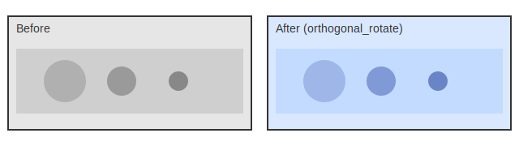
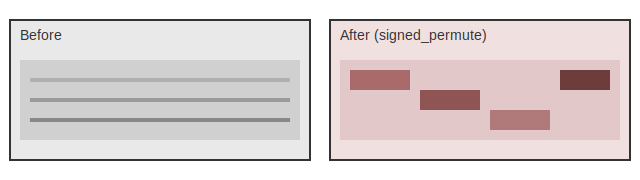
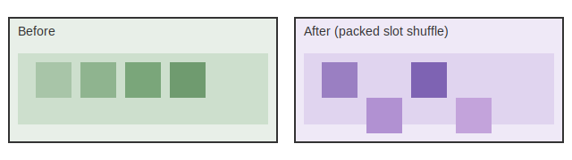

# Skoogeer-Noise

A ComfyUI custom node pack for latent/image/conditioning perturbations, text templating, and diagnostics.

## Overview

- Spatial perturbations (mesh drag warps) for `LATENT` and `IMAGE`.
- Seeded Gaussian noise utilities for `LATENT`, `IMAGE`, and `CONDITIONING`, plus seed fan-out helpers.
- Mustache-based text templating nodes for prompt permutation generation.
- Procedural / structured noise generators (Perlin, Simplex, Worley, reaction-diffusion, fBm, swirl).
- Low/high frequency split helpers for `LATENT` and `CONDITIONING`.
- Experimental model patching for RotorQuant/TurboQuant-style attention approximations.
- Latent diagnostics preview nodes.

This pack was extracted from `ComfyUI-FlowMatching-Upscaler` and also includes the latent/image/conditioning noise + filtering nodes that were previously shipped in `ComfyUI-QwenRectifiedFlowInverter`.

## Contents

- [Overview](#overview)
- [Installation](#installation)
- [Quick Start](#quick-start)
- [Concepts](#concepts)
  - [Data Types / Shapes](#data-types--shapes)
  - [Parameter Conventions](#parameter-conventions)
  - [Selection Modes](#selection-modes)
  - [Flux.2 Patchification](#flux2-patchification)
- [Node Reference](#node-reference)
  - [Node Index](#node-index)
  - [Spatial Perturbations](#spatial-perturbations)
  - [Seeded Noise](#seeded-noise)
  - [Text Templates](#text-templates)
  - [Utilities and Debug](#utilities-and-debug)
  - [Channel Transforms](#channel-transforms)
  - [Frequency Filtering](#frequency-filtering)
  - [Procedural Noise](#procedural-noise)
  - [Flux Tools](#flux-tools)
  - [Model Patches](#model-patches)
  - [Conditioning Tools](#conditioning-tools)
- [Examples Gallery](#examples-gallery)
- [Development](#development)

## Installation

1. Clone into `ComfyUI/custom_nodes/Skoogeer-Noise`
2. Restart ComfyUI

Dependencies: `torch`, `numpy>=1.26`, `einops`, and `pyyaml>=6.0.3` (ComfyUI typically already includes torch/numpy/pyyaml).

## Quick Start

Workflow sketch (SD-style latents):

```
Latent -> Latent Channel Linear Transform (operation=orthogonal_rotate, selection_mode=top_roughness, selection_fraction=0.25, mix=0.6)
      -> Latent Swirl Noise (vortices=3, strength=0.8, mix=0.5)
      -> VAE Decode
```

Flux.2 latents (patchified) should wrap latent-space ops:

```
Unpatchify Flux.2 Latent -> (your latent ops) -> Patchify Flux.2 Latent
```

Tips:

- Use `mask` to localize effects.
- Lower `mix` for subtle edits.
- Pair `Latent Channel Stats Preview` to inspect channel shifts.

## Concepts

### Data Types / Shapes

#### `LATENT`

ComfyUI latents are dictionaries containing a `"samples"` tensor.

- Most SD-style latents: `(B, C, H, W)`
- Some video / flow-matching latents: `(B, C, T, H, W)`

All latent nodes in this pack operate on `latent["samples"]` and preserve other latent dict keys. Most latent nodes accept an optional `mask` input; when provided, the mask is resized to latent resolution (bicubic when downscaling) and the effect is applied only within the mask. `Latent Mesh Drag` also warps `latent["noise_mask"]` when present.

#### `IMAGE`

ComfyUI images are torch tensors in **BHWC** format: `(B, H, W, C)` (usually `C=3`). Some nodes also accept 5D "video" tensors: `(B, T, H, W, C)`.

Image noise nodes accept an optional `mask` input; when provided, the mask is resized to the image resolution (bicubic when downscaling) and the effect is applied only within the mask.

#### `CONDITIONING`

ComfyUI conditioning is a list of `[embedding, metadata]` entries. The conditioning nodes in this pack operate on:

- the embedding tensor (commonly shaped like `(tokens, features)` or `(B, tokens, features)`), and
- `metadata["pooled_output"]` when present.

### Parameter Conventions

- **Seed (`seed`)**: 64-bit integer used to make perturbations repeatable. For batched inputs, noise nodes offset the seed by batch index (`seed + index`) so each sample is deterministic regardless of batch size.
- **Strength (`strength`)**: unless stated otherwise, noise nodes scale their generated pattern by the **standard deviation of the input** (per-sample).
- **Channel mode (`channel_mode`)**:
  - `shared`: reuse one generated field for all channels
  - `per_channel`: reseed and generate per channel
- **Temporal mode (`temporal_mode`)** (5D tensors only):
  - `locked`: reuse one pattern across frames (temporally stable)
  - `animated`: reseed per frame (more variation, can flicker)

#### Common Parameters

| Parameter | Meaning | Notes |
|-----------|---------|-------|
| `seed` | 64-bit integer for repeatable randomness. | When present, it drives deterministic sampling. |
| `strength` | Scales noise relative to the input's standard deviation. | Unless a node defines strength differently. |
| `channel_mode` | Controls whether noise is shared or per-channel. | `shared` reuses one field, `per_channel` reseeds per channel. |
| `temporal_mode` | Controls temporal consistency for 5D tensors. | `locked` is stable, `animated` reseeds per frame. |
| `mix` | Blends original and modified outputs. | `0` = original, `1` = full effect. |
| `mask` | Optional mask limiting the effect. | Resized to target resolution. |

When node tables list these parameters, the Notes column may say "See Common Parameters."

### Selection Modes

- `all`: apply to every channel.
- `random`: choose a random subset per sample using `seed`.
- `top_variance`: choose channels with the highest spatial variance (usually the most active features).
- `top_roughness`: choose channels with the highest mean gradient magnitude (often texture/fine detail carriers).
- `indices`: use the explicit channel list in `selection_indices`.
- `selection_order`: pick `highest` or `lowest` when using `top_variance`/`top_roughness` (low values tend to affect smoother, structural channels).
- `selection_count` overrides `selection_fraction` when `> 0`.

### Flux.2 Patchification

Flux.2 VAEs patchify 2x2 at the final downscale step, producing 128-channel latents at 1/16 spatial resolution. Our latent noise nodes operate on spatial neighborhoods, so applying them directly to patchified latents can introduce 2x2 block artifacts and incorrect spatial correlations. Use `Unpatchify Flux.2 Latent` before running latent noise nodes, then `Patchify Flux.2 Latent` afterward to return to the standard Flux.2 format.

## Node Reference

### Node Index

| Node | Category | Output(s) |
|------|----------|-----------|
| [Latent Mesh Drag](#latent-mesh-drag) | `latent/perturb` | `LATENT` |
| [Image Mesh Drag](#image-mesh-drag) | `image/perturb` | `IMAGE` |
| [Fluid Latent Advection](#fluid-latent-advection) | `latent/perturb` | `LATENT`, `IMAGE` |
| [Fluid Image Advection](#fluid-image-advection) | `image/perturb` | `IMAGE`, `IMAGE` |
| [Latent Smoke Simulation](#latent-smoke-simulation) | `latent/perturb` | `LATENT`, `IMAGE`, `IMAGE` |
| [Image Smoke Simulation](#image-smoke-simulation) | `image/perturb` | `IMAGE`, `IMAGE`, `IMAGE` |
| [Latent Noise](#latent-noise) | `latent/perturb` | `LATENT` |
| [Image Noise](#image-noise) | `image/perturb` | `IMAGE` |
| [Next Seeds](#next-seeds) | `utils/seed` | `INT`, `INT`, `INT`, `INT` |
| [Mustache Variables](#mustache-variables) | `text/template` | `MUSTACHE_VARIABLES` |
| [Mustache Variable Sampler](#mustache-variable-sampler) | `text/template` | `MUSTACHE_VARIABLE_LIST` |
| [Mustache Template](#mustache-template) | `text/template` | `STRING` list |
| [Join Text List](#join-text-list) | `text/debug` | `STRING`, `INT` |
| [Merge Mustache Variable Lists](#merge-mustache-variable-lists) | `text/template` | `MUSTACHE_VARIABLE_LIST` |
| [Concatenate Lists](#concatenate-lists) | `utils/list` | list |
| [Reorder List](#reorder-list) | `utils/list` | list |
| [Latent to Image Batch](#latent-to-image-batch) | `latent/debug` | `IMAGE` |
| [Image Batch to Latent](#image-batch-to-latent) | `latent/debug` | `LATENT` |
| [Latent Channel Stats Preview](#latent-channel-stats-preview) | `latent/debug` | `IMAGE` |
| [Latent Channel Linear Transform](#latent-channel-linear-transform) | `latent/channel` | `LATENT` |
| [Latent Channel Nonlinear Transform](#latent-channel-nonlinear-transform) | `latent/channel` | `LATENT` |
| [Latent Channel Merge](#latent-channel-merge) | `latent/channel` | `LATENT` |
| [Latent Channel Match](#latent-channel-match) | `latent/channel` | `LATENT` |
| [Latent Packed Slot Transform](#latent-packed-slot-transform) | `latent/channel` | `LATENT` |
| [Latent Gaussian Blur](#latent-gaussian-blur) | `Latent/Filter` | `LATENT` |
| [Latent Frequency Split](#latent-frequency-split) | `Latent/Filter` | `LATENT` (low), `LATENT` (high) |
| [Latent Frequency Merge](#latent-frequency-merge) | `Latent/Filter` | `LATENT` |
| [Add Latent Noise (Seeded)](#add-latent-noise-seeded) | `Latent/Noise` | `LATENT` |
| [Add Image Noise (Seeded)](#add-image-noise-seeded) | `Image/Noise` | `IMAGE` |
| [Latent Perlin Fractal Noise](#latent-perlin-fractal-noise) | `Latent/Noise` | `LATENT` |
| [Image Perlin Fractal Noise](#image-perlin-fractal-noise) | `Image/Noise` | `IMAGE` |
| [Latent Simplex Noise](#latent-simplex-noise) | `Latent/Noise` | `LATENT` |
| [Image Simplex Noise](#image-simplex-noise) | `Image/Noise` | `IMAGE` |
| [Latent Worley Noise](#latent-worley-noise) | `Latent/Noise` | `LATENT` |
| [Image Worley Noise](#image-worley-noise) | `Image/Noise` | `IMAGE` |
| [Latent Reaction-Diffusion](#latent-reaction-diffusion) | `Latent/Noise` | `LATENT` |
| [Image Reaction-Diffusion](#image-reaction-diffusion) | `Image/Noise` | `IMAGE` |
| [Latent Fractal Brownian Motion](#latent-fractal-brownian-motion) | `Latent/Noise` | `LATENT` |
| [Image Fractal Brownian Motion](#image-fractal-brownian-motion) | `Image/Noise` | `IMAGE` |
| [Latent Swirl Noise](#latent-swirl-noise) | `Latent/Noise` | `LATENT` |
| [Image Swirl Noise](#image-swirl-noise) | `Image/Noise` | `IMAGE` |
| [Forward Diffusion (Add Scheduled Noise)](#forward-diffusion-add-scheduled-noise) | `Latent/Noise` | `LATENT` |
| [KSampler (LoRA Sigma Inverse)](#ksampler-lora-sigma-inverse) | `sampling` | `LATENT` |
| [Unpatchify Flux.2 Latent](#unpatchify-flux2-latent) | `Latent/Flux` | `LATENT` |
| [Patchify Flux.2 Latent](#patchify-flux2-latent) | `Latent/Flux` | `LATENT` |
| [Model (RotorQuant Attention)](#model-rotorquant-attention) | `model/patch` | `MODEL` |
| [Model (TurboQuant Attention)](#model-turboquant-attention) | `model/patch` | `MODEL` |
| [Conditioning (Add Noise)](#conditioning-add-noise) | `conditioning/noise` | `CONDITIONING` |
| [Conditioning (Gaussian Blur)](#conditioning-gaussian-blur) | `conditioning/filter` | `CONDITIONING` |
| [Conditioning (Frequency Split)](#conditioning-frequency-split) | `conditioning/filter` | `CONDITIONING` (low), `CONDITIONING` (high) |
| [Conditioning (Frequency Merge)](#conditioning-frequency-merge) | `conditioning/filter` | `CONDITIONING` |
| [Conditioning (Scale)](#conditioning-scale) | `conditioning/filter` | `CONDITIONING` |

### Spatial Perturbations

#### Latent Mesh Drag

Applies a cloth-like spatial warp to a `LATENT` by randomly dragging control vertices on a coarse mesh and interpolating a smooth displacement field.

- **Menu category:** `latent/perturb`
- **Returns:** `LATENT`

##### Inputs

| Field | Type | Default | Range/Options | Notes |
|------|------|---------|--------------|------|
| `latent` | `LATENT` | – | – | Latent to warp spatially using a random mesh drag. |
| `mask` | `MASK` | – | – | Optional mask to limit the warp to masked areas. The mask is resized to latent resolution (bicubic when downscaling). |
| `seed` | `INT` | `0` | `0..2^64-1` | Seed controlling which mesh points are dragged and by how much. |
| `points` | `INT` | `12` | `0..2048` | Number of mesh vertices to randomly drag. |
| `drag_min` | `FLOAT` | `0.0` | `0.0..128.0` | Minimum drag distance (**latent pixels**). |
| `drag_max` | `FLOAT` | `4.0` | `0.0..128.0` | Maximum drag distance (**latent pixels**). |
| `direction` | `FLOAT` | `-1.0` | `-1.0..360.0` | Drag direction in degrees (`0`=up, `90`=right, `180`=down, `270`=left). `-1` allows random directions. |
| `stroke_width` | `FLOAT` | `-1.0` | `-1.0..4096.0` | When `>0`, limits the warp to narrow brush-stroke channels aligned with the direction (one per dragged mesh point; when `direction>=0`, stroke centers are jittered so they aren't grid-aligned). Units are **latent pixels**. `-1` disables. |
| `displacement_interpolation` | enum | `bicubic` | `bilinear/bicubic/bspline/nearest` | How to interpolate sparse mesh drags into a full displacement field (`bspline` is smoother). |
| `spline_passes` | `INT` | `2` | `0..16` | Only used when `displacement_interpolation = bspline`. |
| `sampling_interpolation` | enum | `bilinear` | `bilinear/bicubic/nearest` | How to sample the source tensor when applying the warp. |

##### Notes

- Drag distances are specified in **latent pixels** (multiply by ~8 for image-space pixels with SD-style VAEs).
- If a `mask` is supplied, the warp is applied only in the masked area (and the mask is resized to latent resolution).
- If the input latent contains a `noise_mask` tensor, it is warped using the same displacement (and respects the `mask` when provided).

---

#### Image Mesh Drag

Applies the same mesh-drag deformation in image space (pixel units) to ComfyUI `IMAGE` tensors.

- **Menu category:** `image/perturb`
- **Returns:** `IMAGE`

##### Inputs

| Field | Type | Default | Range/Options | Notes |
|------|------|---------|--------------|------|
| `image` | `IMAGE` | – | – | Image to warp spatially using a random mesh drag. |
| `seed` | `INT` | `0` | `0..2^64-1` | Seed controlling which mesh points are dragged and by how much. |
| `points` | `INT` | `12` | `0..4096` | Number of mesh vertices to randomly drag. |
| `drag_min` | `FLOAT` | `0.0` | `0.0..4096.0` | Minimum drag distance (**image pixels**). |
| `drag_max` | `FLOAT` | `32.0` | `0.0..4096.0` | Maximum drag distance (**image pixels**). |
| `direction` | `FLOAT` | `-1.0` | `-1.0..360.0` | Drag direction in degrees (`0`=up, `90`=right, `180`=down, `270`=left). `-1` allows random directions. |
| `stroke_width` | `FLOAT` | `-1.0` | `-1.0..16384.0` | When `>0`, limits the warp to narrow brush-stroke channels aligned with the direction (one per dragged mesh point; when `direction>=0`, stroke centers are jittered so they aren't grid-aligned). Units are **image pixels**. `-1` disables. |
| `displacement_interpolation` | enum | `bicubic` | `bilinear/bicubic/bspline/nearest` | How to interpolate sparse mesh drags into a full displacement field (`bspline` is smoother). |
| `spline_passes` | `INT` | `2` | `0..16` | Only used when `displacement_interpolation = bspline`. |
| `sampling_interpolation` | enum | `bilinear` | `bilinear/bicubic/nearest` | How to sample the source image when applying the warp. |

---

#### Fluid Latent Advection

Advects latent channels through a viscous velocity field and returns a velocity preview image.

- **Menu category:** `latent/perturb`
- **Returns:** `LATENT`, `IMAGE`

##### Inputs

See `docs/fluid-simulation.md` for the full parameter list (shared with the image variant). Core controls include `steps`, `dt`, `resolution_scale`, force injection settings, `vorticity`, and `wrap_mode`.

##### Notes

- Optional `mask` limits the effect to masked areas.

---

#### Fluid Image Advection

Distorts an image by advecting pixels through a viscous velocity field and returns a velocity preview image.

- **Menu category:** `image/perturb`
- **Returns:** `IMAGE`, `IMAGE`

##### Inputs

See `docs/fluid-simulation.md` for the full parameter list (shared with the latent variant). Core controls include `steps`, `dt`, `resolution_scale`, force injection settings, `vorticity`, and `wrap_mode`.

##### Notes

- Optional `mask` limits the effect to masked areas.

---

#### Latent Smoke Simulation

Simulates buoyancy-driven smoke in latent space and returns density and velocity previews.

- **Menu category:** `latent/perturb`
- **Returns:** `LATENT`, `IMAGE`, `IMAGE`

##### Inputs

See `docs/fluid-simulation.md` for smoke-mode parameters such as `smoke_source_mode`, `buoyancy`, `cooling`, and output batching controls.

---

#### Image Smoke Simulation

Simulates buoyancy-driven smoke in image space and returns density and velocity previews.

- **Menu category:** `image/perturb`
- **Returns:** `IMAGE`, `IMAGE`, `IMAGE`

##### Inputs

See `docs/fluid-simulation.md` for smoke-mode parameters such as `smoke_source_mode`, `buoyancy`, `cooling`, and output batching controls.

---

### Seeded Noise

#### Latent Noise

Adds **seeded Gaussian noise** to a ComfyUI `LATENT` dictionary.

- **Menu category:** `latent/perturb`
- **Returns:** `LATENT`

##### Inputs

| Field | Type | Default | Range/Options | Notes |
|------|------|---------|--------------|------|
| `latent` | `LATENT` | – | – | Latent to receive additional Gaussian noise. |
| `seed` | `INT` | `0` | `0..2^64-1` | See Common Parameters. |
| `strength` | `FLOAT` | `1.0` | `0.0..10.0` | See Common Parameters. |

---

#### Image Noise

Adds **seeded Gaussian noise** to a ComfyUI `IMAGE` tensor.

- **Menu category:** `image/perturb`
- **Returns:** `IMAGE`

##### Inputs

| Field | Type | Default | Range/Options | Notes |
|------|------|---------|--------------|------|
| `image` | `IMAGE` | – | – | Image to receive additional Gaussian noise. |
| `seed` | `INT` | `0` | `0..2^64-1` | See Common Parameters. |
| `strength` | `FLOAT` | `1.0` | `0.0..10.0` | See Common Parameters. |

---

#### Next Seeds

Expands one 64-bit seed into four deterministic 64-bit seed outputs using a MurmurHash-style 64-bit mixer over four offset streams.

- **Menu category:** `utils/seed`
- **Returns:** `INT`, `INT`, `INT`, `INT`

##### Inputs

| Field | Type | Default | Range/Options | Notes |
|------|------|---------|--------------|------|
| `seed` | `INT` | `0` | `0..2^64-1` | Base ComfyUI seed. The node first treats it as an unsigned 64-bit integer, then derives four independent-looking child seeds from it. Use this when you want one master seed to drive four downstream nodes without manually picking related seed values. |

##### Outputs

| Output | Type | Description |
|------|------|-------------|
| `seed_1` | `INT` | First derived 64-bit seed. |
| `seed_2` | `INT` | Second derived 64-bit seed. |
| `seed_3` | `INT` | Third derived 64-bit seed. |
| `seed_4` | `INT` | Fourth derived 64-bit seed. |

##### How it works internally

Starting from the input `seed`, the node creates four 64-bit stream values by adding a large fixed increment each time (`0x9E3779B97F4A7C15`, a golden-ratio-derived step commonly used for sequence spacing in hash/PRNG code). Each stream value is then passed through the 64-bit mixer:

```python
x = (x ^ (x >> 33)) & 0xFFFFFFFFFFFFFFFF
x = (x * 0xff51afd7ed558ccd) & 0xFFFFFFFFFFFFFFFF
x = (x ^ (x >> 33)) & 0xFFFFFFFFFFFFFFFF
x = (x * 0xc4ceb9fe1a85ec53) & 0xFFFFFFFFFFFFFFFF
x = (x ^ (x >> 33)) & 0xFFFFFFFFFFFFFFFF
```

This is the MurmurHash3 64-bit finalizer, used here as a strong bit-mixing function rather than as a full hash. Two practical details matter:

- The arithmetic is masked back to `0..2^64-1` after each step, so the outputs stay valid ComfyUI 64-bit seeds.
- The node mixes four offset stream values instead of repeatedly mixing the raw input directly. That avoids the `seed = 0` fixed-point case (`0` would otherwise mix back to `0`) and gives four distinct outputs even from simple nearby inputs.

##### Notes

- The mapping is fully deterministic: the same input `seed` always produces the same four outputs.
- The outputs are intended for seed fan-out, not cryptography.
- Negative values are not accepted by the node UI; if one is supplied programmatically, it is wrapped to unsigned 64-bit before mixing.

---

### Text Templates

#### Mustache Variables

Parses a YAML mapping of variable names to candidate values and packages it as a `MUSTACHE_VARIABLES` dictionary for downstream templating nodes.

- **Menu category:** `text/template`
- **Returns:** `MUSTACHE_VARIABLES`

##### Inputs

| Field | Type | Default | Range/Options | Notes |
|------|------|---------|--------------|------|
| `yaml_text` | `STRING` or `STRING` list | sample YAML | multiline | YAML mapping of variable names to values, or a YAML list of mappings. Lists of scalar values are the normal form for each variable; scalar values are accepted as shorthand and are wrapped into a one-item list. Each final value is coerced to text before rendering. When a list of YAML strings is provided, all mappings are merged together. |
| `variables` | `MUSTACHE_VARIABLE_LIST` | – | optional | Optional concrete variable settings used to render the YAML before parsing it. This is the input to use when you want one `Mustache Variables` stage to templatize another one. Each entry renders the YAML once, and the parsed mappings are then merged together. |

##### Example YAML

```yaml
haircolor:
  - brown
  - blonde
leglength:
  - short
  - long
  - weird
```

Local references can also expand earlier variables in the same YAML:

```yaml
color:
  - brown
  - blue
  - black

hairarrangement:
  - ponytail
  - bun

hairstyle:
  - {{color}} hair in a {{hairarrangement}}
```

##### Notes

- YAML must parse to a mapping or to a list of mappings at the top level.
- Nested objects and nested lists inside variable values are rejected.
- Empty input returns an empty variable set.
- When multiple YAML strings are provided, repeated keys are merged by appending their values in input order.
- If `variables` is connected, `yaml_text` stays as the node's YAML template and the upstream `MUSTACHE_VARIABLE_LIST` is used to render it first.
- That pre-render is now partial: placeholders satisfied by the upstream `variables` input are rendered first, while unresolved placeholders are left in place for the top-down local-YAML expansion pass.
- This is the intended way to chain stages such as `Mustache Variables -> Mustache Variable Sampler -> Reorder List -> Mustache Variables`.
- Do not wire a `MUSTACHE_VARIABLE_LIST` into `yaml_text`; that replaces the YAML template instead of rendering it.
- Variable values may reference variables defined earlier in the same YAML. Those earlier values are expanded in top-to-bottom order, so derived entries like `{{color}} hair` are materialized during parsing.
- Local template references must point to variables defined earlier in the YAML or to values supplied through the optional `variables` input. Referencing a later variable raises an error.
- Random weights can be attached to a variable value by appending `:probability` to the end of the scalar, for example `black:0.4`.
- When any value for a variable uses a `:probability` suffix, every value for that variable must use one, and the probabilities for that variable must sum to `1.0`.
- YAML parsing uses PyYAML's C-backed safe loader when it is available, which materially reduces CPU time for large templated-YAML batches.
- The `variables` input tolerates nested list wrappers from upstream list utilities and concatenation nodes, as long as the leaves are variable-setting dictionaries.

---

#### Mustache Variable Sampler

Expands a `MUSTACHE_VARIABLES` mapping into a `MUSTACHE_VARIABLE_LIST`, where each entry is a concrete variable assignment like `{"haircolor": "brown", "leglength": "short"}`.

- **Menu category:** `text/template`
- **Returns:** `MUSTACHE_VARIABLE_LIST`

##### Inputs

| Field | Type | Default | Range/Options | Notes |
|------|------|---------|--------------|------|
| `variables` | `MUSTACHE_VARIABLES` | – | – | Variable mapping to expand into concrete per-prompt settings. |
| `sampling_mode` | enum | `sequential` | `sequential/random` | `sequential` walks the Cartesian product in stable order. `random` randomizes key order, value order, and sampled permutation order before emitting concrete settings. |
| `seed` | `INT` | `0` | `0..2^64-1` | 64-bit seed used when `sampling_mode = random`. The same seed yields the same concrete variable-setting order. |
| `limit` | `INT` | `-1` | `-1..2147483647` | Maximum number of concrete variable settings to emit. `-1` means no limit. |

##### Notes

- This node now owns permutation generation, so large Cartesian products can be capped before `Mustache Template` runs.
- In `random` mode, the sampler does not merely shuffle value lists. It randomizes key order, value order, and the emitted permutation order so the resulting `MUSTACHE_VARIABLE_LIST` is a seeded random subset/permutation of the full space.
- When a variable value list carries `:probability` metadata from `Mustache Variables`, random sampling uses those probabilities instead of assuming a uniform distribution.
- Weighted random sampling still emits unique concrete settings. For moderate product sizes it does exact weighted sampling without replacement; for huge spaces it falls back to repeated weighted draws with duplicate rejection.
- When `limit` is finite, random sampling draws unique permutation indices directly from the full mixed-radix space in `O(limit)` time and memory. It does not rely on `random.sample(range(...))`, so it still works when the total permutation count is larger than Python's `Py_ssize_t` range.
- If `limit = -1`, the node is being asked to materialize the full output list. To avoid workflows that appear hung on huge permutation spaces, unbounded expansion now raises an error once the total setting count exceeds `100000`; use a finite `limit` in those cases.

---

#### Mustache Template

Renders a template string containing mustache placeholders like `{{haircolor}}` against a `MUSTACHE_VARIABLE_LIST` and outputs one string per concrete variable-setting entry. Because the output is a ComfyUI `STRING` list, downstream nodes such as `CLIP Text Encode` will execute once per rendered prompt.

- **Menu category:** `text/template`
- **Returns:** `STRING` list

##### Inputs

| Field | Type | Default | Range/Options | Notes |
|------|------|---------|--------------|------|
| `variables` | `MUSTACHE_VARIABLE_LIST` | – | – | Concrete variable settings generated by `Mustache Variable Sampler`. One output prompt is rendered for each list entry. |
| `template` | `STRING` | `"The man has {{haircolor}} hair and {{leglength}} legs."` | multiline | Template text to render. Every referenced placeholder must exist in each `MUSTACHE_VARIABLE_LIST` entry. Repeated placeholders reuse the same selected value within a given entry. |

##### How permutation expansion works

The node itself no longer computes permutations. Instead, it receives an already-expanded `MUSTACHE_VARIABLE_LIST` from `Mustache Variable Sampler` and renders the template once per entry.

For the example above and the template:

```text
The man has {{haircolor}} hair and {{leglength}} legs.
```

the node emits these six strings, in order:

```text
The man has brown hair and short legs.
The man has brown hair and long legs.
The man has brown hair and weird legs.
The man has blonde hair and short legs.
The man has blonde hair and long legs.
The man has blonde hair and weird legs.
```

##### Notes

- Variables present in a `MUSTACHE_VARIABLE_LIST` entry but not referenced in the template are ignored.
- Templates with no placeholders are repeated once for each entry in the variable list.
- Referencing a missing variable raises an error instead of silently leaving `{{name}}` in place.
- The renderer compiles the mustache template into a reusable Python format string once per node execution, which further reduces CPU overhead on large prompt batches while preserving literal `{}` text.
- ComfyUI's built-in `Preview as Text` typically only shows the first item from a list-valued `STRING` output. Use `Join Text List` before previewing if you want to inspect the whole rendered batch.

---

#### Join Text List

Consumes a list-valued `STRING` input and joins every item into one string so preview/debug nodes can show the whole batch at once.

- **Menu category:** `text/debug`
- **Returns:** `STRING`, `INT`

##### Inputs

| Field | Type | Default | Range/Options | Notes |
|------|------|---------|--------------|------|
| `text` | `STRING` list | – | – | List-valued string input, such as the output of `Mustache Template`. |
| `separator` | `STRING` | `\n` | multiline | Text inserted between each item. Escape sequences like `\n`, `\r`, and `\t` are decoded, so values like `\n===\n` produce visible section breaks. |

##### Outputs

| Output | Type | Description |
|------|------|-------------|
| `text` | `STRING` | All list items joined with the requested separator. |
| `count` | `INT` | Number of input strings that were joined. |

##### Notes

- The node unwraps singleton-list widget values for `separator`, which matches how ComfyUI sometimes passes control inputs into list-aware nodes.

##### Typical usage

```text
Mustache Template -> Join Text List -> Preview as Text
```

---

#### Merge Mustache Variable Lists

Merges two `MUSTACHE_VARIABLE_LIST` inputs entry-by-entry so each output entry contains the union of keys from both sides. This is the node to use when one branch produces fields like `camera_lens` and another produces fields like `person_masc`, and your downstream template needs both in the same rendered entry.

- **Menu category:** `text/template`
- **Returns:** `MUSTACHE_VARIABLE_LIST`

##### Inputs

| Field | Type | Default | Range/Options | Notes |
|------|------|---------|--------------|------|
| `items_1` | `MUSTACHE_VARIABLE_LIST` | – | – | First variable-setting list. |
| `items_2` | `MUSTACHE_VARIABLE_LIST` | – | – | Second variable-setting list. Keys from this side overwrite duplicate keys from `items_1`. |

##### Outputs

| Output | Type | Description |
|------|------|-------------|
| `items` | `MUSTACHE_VARIABLE_LIST` | Entry-by-entry merged variable-setting list. |

##### Notes

- If both inputs have the same length, entries are merged by index.
- If one side has exactly one entry, that singleton entry is broadcast across the other side.
- If both sides have different lengths greater than one, the node raises an error.
- Use this instead of `Concatenate Lists` when downstream templates need one entry that contains keys from both branches.

---

#### Reorder List

Reorders a list-valued input without changing the item type. This is a generic utility node that can reverse any list or apply a seeded shuffle.

- **Menu category:** `utils/list`
- **Returns:** list of the same item type

##### Inputs

| Field | Type | Default | Range/Options | Notes |
|------|------|---------|--------------|------|
| `items` | list | – | – | List-valued input to reorder. |
| `mode` | enum | `shuffle` | `shuffle/reverse` | `shuffle` applies a seeded random permutation. `reverse` flips the list order. |
| `seed` | `INT` | `0` | `0..2^64-1` | 64-bit seed used when `mode = shuffle`. The same seed yields the same permutation. |

##### Outputs

| Output | Type | Description |
|------|------|-------------|
| `items` | list | Reordered list of the same item type as the input. |

##### Notes

- This node is list-aware and intended for list-valued sockets such as `STRING` lists coming out of `Mustache Template`.
- `reverse` ignores `seed`.

---

#### Concatenate Lists

Concatenates two list-valued inputs into one list without changing the item type. This is useful when you want to append batches, not when you need to combine per-entry dictionaries.

- **Menu category:** `utils/list`
- **Returns:** list of the same item type

##### Inputs

| Field | Type | Default | Range/Options | Notes |
|------|------|---------|--------------|------|
| `items_1` | list | – | – | First list-valued input. |
| `items_2` | list | – | – | Second list-valued input, appended after `items_1`. |

##### Outputs

| Output | Type | Description |
|------|------|-------------|
| `items` | list | Concatenation of `items_1` followed by `items_2`. |

##### Notes

- This node is generic and works with `MUSTACHE_VARIABLE_LIST`, `STRING` lists, and other list-valued sockets.
- For the mustache workflow, the list-valued node is `Mustache Variable Sampler`; `Mustache Variables` itself still returns a `MUSTACHE_VARIABLES` mapping.
- For mustache workflows, use `Merge Mustache Variable Lists` instead when a downstream template needs each output entry to include keys from both input branches.

---

### Utilities and Debug

#### Latent to Image Batch

Converts each latent channel into its own grayscale image and batches the results.

- **Menu category:** `latent/debug`
- **Returns:** `IMAGE`

##### Inputs

| Field | Type | Default | Range/Options | Notes |
|------|------|---------|--------------|------|
| `latent` | `LATENT` | – | – | Latent to render into per-channel grayscale images. |
| `normalize` | `BOOLEAN` | `false` | – | If true, per-image min/max normalization maps values into `[0,1]`. |
| `output_channels` | enum | `3` | `1/3` | Use `3` to repeat grayscale into RGB for PreviewImage compatibility; output shape is `(B*C, H, W, C)`. |

---

#### Image Batch to Latent

Merges a batch of per-channel grayscale images back into a `LATENT` tensor.

- **Menu category:** `latent/debug`
- **Returns:** `LATENT`

##### Inputs

| Field | Type | Default | Range/Options | Notes |
|------|------|---------|--------------|------|
| `image_batch` | `IMAGE` | – | – | Batch of images representing latent channels. |
| `batch_size` | `INT` | `0` | `0..4096` | Original latent batch size (`0` to infer from `channels`). |
| `channels` | `INT` | `0` | `0..4096` | Channel count per latent sample (`0` to infer from `batch_size`). |
| `channel_source` | enum | `r` | `r/g/b/mean` | Which channel to use from RGB inputs (mean averages channels). |

---

#### Latent Channel Stats Preview

Renders a bar-chart preview of **per-channel mean and standard deviation** for `LATENT["samples"]`.

- **Menu category:** `latent/debug`
- **Returns:** `IMAGE`

##### Inputs

| Field | Type | Default | Range/Options | Notes |
|------|------|---------|--------------|------|
| `latent` | `LATENT` | – | – | Latent to analyze. |
| `channel_limit` | `INT` | `16` | `1..64` | Number of channels to display. |
| `height` | `INT` | `256` | `72..1024` | Output image height (layout adjusts automatically). |

---

### Channel Transforms

#### Latent Channel Linear Transform

Applies **linear channel-space transforms** (signed permutations, orthogonal rotations, Householder reflections, low-rank shears).

- **Menu category:** `latent/channel`
- **Returns:** `LATENT`

##### Inputs

| Field | Type | Default | Range/Options | Notes |
|------|------|---------|--------------|------|
| `latent` | `LATENT` | – | – | Latent to transform in channel-space. |
| `operation` | enum | `signed_permute` | `signed_permute/orthogonal_rotate/householder_reflect/low_rank_shear` | Linear transform to apply. |
| `seed` | `INT` | `0` | `0..2^64-1` | Seed for deterministic selection/transforms. |
| `sign_flip_prob` | `FLOAT` | `0.5` | `0.0..1.0` | Sign-flip probability for signed permutations. |
| `tile_size` | `INT` | `0` | `0..512` | Tile size (latent pixels) for per-tile permutations. |
| `block_size` | `INT` | `0` | `0..4096` | Channels per orthogonal block (`0` = full). |
| `alpha` | `FLOAT` | `0.5` | `-4.0..4.0` | Shear strength for low-rank shear. |
| `selection_mode` | enum | `all` | `all/random/top_variance/top_roughness/indices` | Channel selection strategy. |
| `selection_fraction` | `FLOAT` | `1.0` | `0.0..1.0` | Fraction of channels when `selection_count=0`. |
| `selection_count` | `INT` | `0` | `0..4096` | Exact number of channels (overrides fraction). |
| `selection_order` | enum | `highest` | `highest/lowest` | Choose high or low variance/roughness. |
| `selection_indices` | `STRING` | `""` | – | Comma-separated indices when `selection_mode=indices`. |
| `mix` | `FLOAT` | `1.0` | `0.0..1.0` | See Common Parameters. |
| `match_stats` | `BOOLEAN` | `false` | – | Match per-channel mean/std after edit. |
| `mask` | `MASK` | – | – | Optional mask to limit the transform. |

##### Mode behavior + impact

| Mode | What it does | Likely impact |
|------|--------------|---------------|
| `signed_permute` | Reorders selected channels; optional sign flips keep norms but remap the feature basis. | Hard, crunchy remaps and codec-like glitches that often retain overall structure. |
| `orthogonal_rotate` | Globally mixes channels via an orthogonal rotation (energy-preserving). | Smooth “style drift” shifts in material/texture without tearing; more coherent than permutation. |
| `householder_reflect` | Reflects along a random feature direction (single hyperplane flip). | Inversion-like feature accents; can feel like latent “photonegative” or specular inversions. |
| `low_rank_shear` | Rank‑1 update: measure along one direction and add along another. | Feature feedback / resonance; can create blooming or melting effects without total scramble. |

---

#### Latent Channel Nonlinear Transform

Applies **nonlinear channel-space transforms** (gating, quantization, clipping, dropout/replacement).

- **Menu category:** `latent/channel`
- **Returns:** `LATENT`

##### Inputs

| Field | Type | Default | Range/Options | Notes |
|------|------|---------|--------------|------|
| `latent` | `LATENT` | – | – | Latent to transform in channel-space. |
| `operation` | enum | `gate_multiply` | `gate_multiply/gate_add/quantize/clip_hard/clip_soft/dropout_zero/dropout_noise/dropout_swap` | Nonlinear transform to apply. |
| `seed` | `INT` | `0` | `0..2^64-1` | Seed for deterministic gating/dropout. |
| `gate_strength` | `FLOAT` | `1.0` | `0.0..10.0` | Gate slope (gate_* operations). |
| `beta` | `FLOAT` | `1.0` | `-4.0..4.0` | Gate scale (gate_* operations). |
| `blur_radius` | `INT` | `0` | `0..64` | Blur radius for gate maps (latent pixels). |
| `quantize_step` | `FLOAT` | `0.25` | `0.0..10.0` | Step size for quantization. |
| `clip_threshold` | `FLOAT` | `2.0` | `0.0..10.0` | Threshold for clipping. |
| `selection_mode` | enum | `all` | `all/random/top_variance/top_roughness/indices` | Channel selection strategy. |
| `selection_fraction` | `FLOAT` | `1.0` | `0.0..1.0` | Fraction of channels when `selection_count=0`. |
| `selection_count` | `INT` | `0` | `0..4096` | Exact number of channels (overrides fraction). |
| `selection_order` | enum | `highest` | `highest/lowest` | Choose high or low variance/roughness. |
| `selection_indices` | `STRING` | `""` | – | Comma-separated indices when `selection_mode=indices`. |
| `mix` | `FLOAT` | `1.0` | `0.0..1.0` | See Common Parameters. |
| `match_stats` | `BOOLEAN` | `false` | – | Match per-channel mean/std after edit. |
| `mask` | `MASK` | – | – | Optional mask to limit the transform. |

##### Mode behavior + impact

| Mode | What it does | Likely impact |
|------|--------------|---------------|
| `gate_multiply` | Builds a per‑pixel gate from a random projection and multiplies channels by it. | Self‑amplifying/suppressing regions; “alive” glitches that track existing structure. |
| `gate_add` | Computes a gate and adds a gated feature direction back into channels. | Content‑dependent bias; can create halos, embossed edges, or resonant highlights. |
| `quantize` | Rounds values to a fixed step size. | Posterized, crunchy textures; flatter gradients and vector‑art vibe. |
| `clip_hard` | Hard clamps values to `[-t, t]`. | Removes sharp spikes; can flatten detail and yield plasticky surfaces. |
| `clip_soft` | Soft clamps with `tanh` at threshold `t`. | Gentler compression; dreamy/flattened details without abrupt clipping. |
| `dropout_zero` | Zeros selected channels. | Missing‑feature hallucinations; sudden structure loss and glitch gaps. |
| `dropout_noise` | Replaces channels with mean/std‑matched noise. | Grainy, unstable textures while keeping channel statistics stable. |
| `dropout_swap` | Swaps selected channels with other random channels. | Channel cross‑talk artifacts; can look like latent “miswiring.” |

---

#### Latent Channel Merge

Blends selected channels from a **source** latent into a **destination** latent.

- **Menu category:** `latent/channel`
- **Returns:** `LATENT`

##### Inputs

| Field | Type | Default | Range/Options | Notes |
|------|------|---------|--------------|------|
| `destination` | `LATENT` | – | – | Latent to blend into (destination). |
| `source` | `LATENT` | – | – | Latent providing channels to blend (source). |
| `seed` | `INT` | `0` | `0..2^64-1` | Seed for deterministic selection when `selection_mode=random`. |
| `selection_mode` | enum | `all` | `all/random/top_variance/top_roughness/indices` | Channel selection strategy (metrics measured on the source latent). |
| `selection_fraction` | `FLOAT` | `1.0` | `0.0..1.0` | Fraction of channels when `selection_count=0`. |
| `selection_count` | `INT` | `0` | `0..4096` | Exact number of channels (overrides fraction). |
| `selection_order` | enum | `highest` | `highest/lowest` | Choose high or low variance/roughness. |
| `selection_indices` | `STRING` | `""` | – | Comma-separated indices when `selection_mode=indices`. |
| `blend_strength` | `FLOAT` | `1.0` | `-4.0..4.0` | Blend factor for selected channels (`0` keeps destination, `1` uses source, values outside `[0,1]` extrapolate). |
| `mask` | `MASK` | – | – | Optional mask to limit the merge. |

---

#### Latent Channel Match

Transfers the **per-channel mean and standard deviation** from a **reference** latent onto a **target** latent, similar to a color-match operation but performed directly in latent space.

- **Menu category:** `latent/channel`
- **Returns:** `LATENT`

##### Inputs

| Field | Type | Default | Range/Options | Notes |
|------|------|---------|--------------|------|
| `target` | `LATENT` | – | – | Latent whose channels will be normalized to match the reference statistics. |
| `reference` | `LATENT` | – | – | Latent providing the per-channel mean/std to transfer. |
| `mix` | `FLOAT` | `1.0` | `0.0..1.0` | Blend factor between the original target and the fully matched result. |
| `mask` | `MASK` | – | – | Optional mask to limit the matched result spatially. |

##### Notes

- Matching is done independently per channel using the reference channel mean/std and the target channel mean/std.
- The reference latent can either flatten to one sample or to the same flattened sample count as the target. A single reference sample broadcasts across the target batch.
- Spatial sizes may differ between reference and target because only channel statistics are transferred.
- This is useful for latent-space “palette transfer” or for normalizing one latent toward another latent’s overall channel distribution before downstream blending or decoding.

---

#### Latent Packed Slot Transform

Applies **slot-level operations** to packed (space-to-depth) latents by permuting/rotating the `P x P` slots inside the channel dimension.

- **Menu category:** `latent/channel`
- **Returns:** `LATENT`

##### Inputs

| Field | Type | Default | Range/Options | Notes |
|------|------|---------|--------------|------|
| `latent` | `LATENT` | – | – | Packed latent to transform per slot. |
| `operation` | enum | `shuffle` | `shuffle/rotate_cw/rotate_ccw/flip_h/flip_v` | Slot operation to apply. |
| `patch_size` | `INT` | `2` | `1..8` | Patch size `P` for `P x P` slot layout. |
| `base_channels` | `INT` | `0` | `0..4096` | Base channels before packing (`0` = infer). |
| `seed` | `INT` | `0` | `0..2^64-1` | Seed for slot shuffles. |
| `mix` | `FLOAT` | `1.0` | `0.0..1.0` | See Common Parameters. |
| `match_stats` | `BOOLEAN` | `false` | – | Match per-channel mean/std after edit. |
| `mask` | `MASK` | – | – | Optional mask to limit the transform. |

##### Mode behavior + impact

| Mode | What it does | Likely impact |
|------|--------------|---------------|
| `shuffle` | Randomly permutes the `P x P` slot ordering within each base channel. | Digital macro‑blocking, moiré‑like micro‑shifts, checkerboard artifacts. |
| `rotate_cw` | Rotates the slot grid clockwise (90 degrees). | Directional slot shifts; subtle “micro‑rotation” with structured aliasing. |
| `rotate_ccw` | Rotates the slot grid counterclockwise (90 degrees). | Same as rotate_cw but in opposite direction; can pair for oscillation. |
| `flip_h` | Flips slots left‑right. | Mirrored slot patterns; can cause chromatic‑aberration‑like shifts. |
| `flip_v` | Flips slots top‑bottom. | Vertical slot mirroring; structured digital shimmer. |

---

### Frequency Filtering

#### Latent Gaussian Blur

Gaussian blur for latents (supports both 4D and 5D latents).

- **Menu category:** `Latent/Filter`
- **Returns:** `LATENT`

##### Inputs

| Field | Type | Default | Range/Options | Notes |
|------|------|---------|--------------|------|
| `latent` | `LATENT` | – | – | Latent tensor to blur. |
| `sigma` | `FLOAT` | `1.0` | `0.0..10.0` | Standard deviation for the Gaussian kernel. `0` is a no-op. |
| `blur_mode` | enum | `Spatial Only` | `Spatial Only/Spatial and Channel` | When `Spatial and Channel`, also blurs across the channel dimension. |

---

#### Latent Frequency Split

Splits a latent into **low-pass** and **high-pass** bands by subtracting a Gaussian-smoothed version.

- **Menu category:** `Latent/Filter`
- **Returns:** `LATENT` (low), `LATENT` (high)

##### Inputs

| Field | Type | Default | Range/Options | Notes |
|------|------|---------|--------------|------|
| `latent` | `LATENT` | – | – | Latent to decompose into low/high frequency bands. |
| `sigma` | `FLOAT` | `1.5` | `0.0..20.0` | Radius of Gaussian low-pass. Higher moves more detail into the high band. |

##### Outputs

- `low_pass`: blurred latent
- `high_pass`: `latent - low_pass` (zeros when `sigma <= 0`)

---

#### Latent Frequency Merge

Merges the **low-pass** and **high-pass** bands back into a single latent.

- **Menu category:** `Latent/Filter`
- **Returns:** `LATENT`

##### Inputs

| Field | Type | Default | Range/Options | Notes |
|------|------|---------|--------------|------|
| `low_pass` | `LATENT` | – | – | Low-frequency latent band produced by `Latent Frequency Split`. |
| `high_pass` | `LATENT` | – | – | High-frequency latent band to merge back in. |
| `low_gain` | `FLOAT` | `1.0` | `-5.0..5.0` | Multiplier for the low-pass band before merging. |
| `high_gain` | `FLOAT` | `1.0` | `-5.0..5.0` | Multiplier for the high-pass band before merging. |

##### Output

- `merged`: `low_pass * low_gain + high_pass * high_gain`

---

### Procedural Noise

#### Add Latent Noise (Seeded)

Adds seeded Gaussian noise to `LATENT["samples"]` (strength is relative to the latent's standard deviation).

- **Menu category:** `Latent/Noise`
- **Returns:** `LATENT`

##### Inputs

| Field | Type | Default | Range/Options | Notes |
|------|------|---------|--------------|------|
| `latent` | `LATENT` | – | – | Latent to receive additional Gaussian noise. |
| `seed` | `INT` | `0` | `0..2^64-1` | See Common Parameters. |
| `strength` | `FLOAT` | `1.0` | `0.0..10.0` | `1.0` adds noise with roughly the same std as the latent. |

---

#### Add Image Noise (Seeded)

Adds seeded Gaussian noise to an `IMAGE` tensor (strength is relative to the image's standard deviation).

- **Menu category:** `Image/Noise`
- **Returns:** `IMAGE`

##### Inputs

| Field | Type | Default | Range/Options | Notes |
|------|------|---------|--------------|------|
| `image` | `IMAGE` | – | – | Image to receive additional Gaussian noise. |
| `seed` | `INT` | `0` | `0..2^64-1` | See Common Parameters. |
| `strength` | `FLOAT` | `1.0` | `0.0..10.0` | `1.0` adds noise with roughly the same std as the image. |

---

#### Latent Perlin Fractal Noise

Adds smooth **fractal Perlin noise** to a latent for structured variation.

- **Menu category:** `Latent/Noise`
- **Returns:** `LATENT`

##### Inputs

| Field | Type | Default | Range/Options | Notes |
|------|------|---------|--------------|------|
| `latent` | `LATENT` | – | – | Latent that will be perturbed with fractal Perlin noise. |
| `seed` | `INT` | `0` | `0..2^64-1` | Seed controlling the procedural noise pattern. |
| `frequency` | `FLOAT` | `2.0` | `0.01..64.0` | Base lattice frequency (higher = finer detail). |
| `octaves` | `INT` | `4` | `1..12` | Number of noise layers to accumulate. |
| `persistence` | `FLOAT` | `0.5` | `0.0..1.0` | Amplitude multiplier between octaves. |
| `lacunarity` | `FLOAT` | `2.0` | `1.0..6.0` | Frequency multiplier between octaves. |
| `strength` | `FLOAT` | `0.5` | `0.0..5.0` | Scales normalized noise relative to the latent's standard deviation. |
| `channel_mode` | enum | `shared` | `shared/per_channel` | See Common Parameters. |

##### Notes

- For 5D latents `(B,C,T,H,W)`, this node generates **3D Perlin noise** across `(T,H,W)` (no `temporal_mode` parameter).

---

#### Image Perlin Fractal Noise

Adds smooth **fractal Perlin noise** to an image for structured variation.

- **Menu category:** `Image/Noise`
- **Returns:** `IMAGE`

##### Inputs

| Field | Type | Default | Range/Options | Notes |
|------|------|---------|--------------|------|
| `image` | `IMAGE` | – | – | Image that will be perturbed with fractal Perlin noise. |
| `seed` | `INT` | `0` | `0..2^64-1` | Seed controlling the procedural noise pattern. |
| `frequency` | `FLOAT` | `2.0` | `0.01..64.0` | Base lattice frequency (higher = finer detail). |
| `octaves` | `INT` | `4` | `1..12` | Number of noise layers to accumulate. |
| `persistence` | `FLOAT` | `0.5` | `0.0..1.0` | Amplitude multiplier between octaves. |
| `lacunarity` | `FLOAT` | `2.0` | `1.0..6.0` | Frequency multiplier between octaves. |
| `strength` | `FLOAT` | `0.5` | `0.0..5.0` | Scales normalized noise relative to the image's standard deviation. |
| `channel_mode` | enum | `shared` | `shared/per_channel` | See Common Parameters. |
| `temporal_mode` | enum | `locked` | `locked/animated` | See Common Parameters. |

---

#### Latent Simplex Noise

Adds layered **fractal simplex noise** to a latent for organic perturbations.

- **Menu category:** `Latent/Noise`
- **Returns:** `LATENT`

##### Inputs

| Field | Type | Default | Range/Options | Notes |
|------|------|---------|--------------|------|
| `latent` | `LATENT` | – | – | Latent to perturb with simplex noise. |
| `seed` | `INT` | `0` | `0..2^64-1` | Seed controlling the simplex lattice offsets. |
| `frequency` | `FLOAT` | `2.0` | `0.01..64.0` | Base lattice frequency for the simplex grid. |
| `octaves` | `INT` | `4` | `1..12` | Number of simplex layers to accumulate. |
| `persistence` | `FLOAT` | `0.5` | `0.0..1.0` | Amplitude multiplier applied between octaves. |
| `lacunarity` | `FLOAT` | `2.0` | `1.0..6.0` | Frequency multiplier applied between octaves. |
| `strength` | `FLOAT` | `0.5` | `0.0..5.0` | Scales normalized simplex noise relative to the latent's standard deviation. |
| `channel_mode` | enum | `shared` | `shared/per_channel` | See Common Parameters. |
| `temporal_mode` | enum | `locked` | `locked/animated` | See Common Parameters. |

---

#### Image Simplex Noise

Adds layered **fractal simplex noise** to an image.

- **Menu category:** `Image/Noise`
- **Returns:** `IMAGE`

##### Inputs

| Field | Type | Default | Range/Options | Notes |
|------|------|---------|--------------|------|
| `image` | `IMAGE` | – | – | Image to perturb with simplex noise. |
| `seed` | `INT` | `0` | `0..2^64-1` | Seed controlling the simplex lattice offsets. |
| `frequency` | `FLOAT` | `2.0` | `0.01..64.0` | Base lattice frequency for the simplex grid. |
| `octaves` | `INT` | `4` | `1..12` | Number of simplex layers to accumulate. |
| `persistence` | `FLOAT` | `0.5` | `0.0..1.0` | Amplitude multiplier applied between octaves. |
| `lacunarity` | `FLOAT` | `2.0` | `1.0..6.0` | Frequency multiplier applied between octaves. |
| `strength` | `FLOAT` | `0.5` | `0.0..5.0` | Scales normalized simplex noise relative to the image's standard deviation. |
| `channel_mode` | enum | `shared` | `shared/per_channel` | See Common Parameters. |
| `temporal_mode` | enum | `locked` | `locked/animated` | See Common Parameters. |

---

#### Latent Worley Noise

Generates **cellular (Worley) noise** for cracked / biological / bubble-like textures.

- **Menu category:** `Latent/Noise`
- **Returns:** `LATENT`

##### Inputs

| Field | Type | Default | Range/Options | Notes |
|------|------|---------|--------------|------|
| `latent` | `LATENT` | – | – | Latent to perturb with Worley (cellular) noise. |
| `seed` | `INT` | `0` | `0..2^64-1` | Seed for the feature point distribution. |
| `feature_points` | `INT` | `16` | `1..4096` | Base number of feature points scattered across the plane. |
| `octaves` | `INT` | `3` | `1..8` | Number of cellular layers to accumulate. |
| `persistence` | `FLOAT` | `0.65` | `0.0..1.0` | Amplitude multiplier between Worley octaves. |
| `lacunarity` | `FLOAT` | `2.0` | `1.0..6.0` | Multiplier for the feature point count between octaves. |
| `distance_metric` | enum | `euclidean` | `euclidean/manhattan/chebyshev` | Distance metric used when measuring feature proximity. |
| `jitter` | `FLOAT` | `0.35` | `0.0..1.0` | How far feature points can drift inside each cell. |
| `strength` | `FLOAT` | `0.5` | `0.0..5.0` | Scales normalized Worley noise relative to the latent's standard deviation. |
| `channel_mode` | enum | `shared` | `shared/per_channel` | See Common Parameters. |
| `temporal_mode` | enum | `locked` | `locked/animated` | See Common Parameters. |

---

#### Image Worley Noise

Generates **cellular (Worley) noise** and injects it into an image.

- **Menu category:** `Image/Noise`
- **Returns:** `IMAGE`

##### Inputs

| Field | Type | Default | Range/Options | Notes |
|------|------|---------|--------------|------|
| `image` | `IMAGE` | – | – | Image to perturb with Worley (cellular) noise. |
| `seed` | `INT` | `0` | `0..2^64-1` | Seed for the feature point distribution. |
| `feature_points` | `INT` | `16` | `1..4096` | Base number of feature points scattered across the plane. |
| `octaves` | `INT` | `3` | `1..8` | Number of cellular layers to accumulate. |
| `persistence` | `FLOAT` | `0.65` | `0.0..1.0` | Amplitude multiplier between Worley octaves. |
| `lacunarity` | `FLOAT` | `2.0` | `1.0..6.0` | Multiplier for the feature point count between octaves. |
| `distance_metric` | enum | `euclidean` | `euclidean/manhattan/chebyshev` | Distance metric used when measuring feature proximity. |
| `jitter` | `FLOAT` | `0.35` | `0.0..1.0` | How far feature points can drift inside each cell. |
| `strength` | `FLOAT` | `0.5` | `0.0..5.0` | Scales normalized Worley noise relative to the image's standard deviation. |
| `channel_mode` | enum | `shared` | `shared/per_channel` | See Common Parameters. |
| `temporal_mode` | enum | `locked` | `locked/animated` | See Common Parameters. |

---

#### Latent Reaction-Diffusion

Runs a Gray-Scott **reaction-diffusion** simulation and injects the resulting pattern into a latent.

- **Menu category:** `Latent/Noise`
- **Returns:** `LATENT`

##### Inputs

| Field | Type | Default | Range/Options | Notes |
|------|------|---------|--------------|------|
| `latent` | `LATENT` | – | – | Latent that will receive reaction-diffusion patterns. |
| `seed` | `INT` | `0` | `0..2^64-1` | Seed for the initial chemical concentrations. |
| `iterations` | `INT` | `200` | `1..2000` | Number of Gray-Scott simulation steps. |
| `feed_rate` | `FLOAT` | `0.036` | `0.0..0.1` | Feed rate (F) controlling how quickly chemical U is replenished. |
| `kill_rate` | `FLOAT` | `0.065` | `0.0..0.1` | Kill rate (K) regulating removal of chemical V. |
| `diffusion_u` | `FLOAT` | `0.16` | `0.0..1.0` | Diffusion rate for chemical U. |
| `diffusion_v` | `FLOAT` | `0.08` | `0.0..1.0` | Diffusion rate for chemical V. |
| `time_step` | `FLOAT` | `1.0` | `0.01..5.0` | Simulation time step used during integration. |
| `strength` | `FLOAT` | `0.75` | `0.0..5.0` | Scales normalized pattern relative to the latent's standard deviation. |
| `channel_mode` | enum | `shared` | `shared/per_channel` | Reuse one simulation for all channels or rerun per channel. |
| `temporal_mode` | enum | `locked` | `locked/animated` | See Common Parameters. |

---

#### Image Reaction-Diffusion

Runs a Gray-Scott **reaction-diffusion** simulation and injects the resulting pattern into an image.

- **Menu category:** `Image/Noise`
- **Returns:** `IMAGE`

##### Inputs

| Field | Type | Default | Range/Options | Notes |
|------|------|---------|--------------|------|
| `image` | `IMAGE` | – | – | Image that will receive reaction-diffusion patterns. |
| `seed` | `INT` | `0` | `0..2^64-1` | Seed for the initial chemical concentrations. |
| `iterations` | `INT` | `200` | `1..2000` | Number of Gray-Scott simulation steps. |
| `feed_rate` | `FLOAT` | `0.036` | `0.0..0.1` | Feed rate (F) controlling how quickly chemical U is replenished. |
| `kill_rate` | `FLOAT` | `0.065` | `0.0..0.1` | Kill rate (K) regulating removal of chemical V. |
| `diffusion_u` | `FLOAT` | `0.16` | `0.0..1.0` | Diffusion rate for chemical U. |
| `diffusion_v` | `FLOAT` | `0.08` | `0.0..1.0` | Diffusion rate for chemical V. |
| `time_step` | `FLOAT` | `1.0` | `0.01..5.0` | Simulation time step used during integration. |
| `strength` | `FLOAT` | `0.75` | `0.0..5.0` | Scales normalized pattern relative to the image's standard deviation. |
| `channel_mode` | enum | `shared` | `shared/per_channel` | Reuse one simulation for all channels or rerun per channel. |
| `temporal_mode` | enum | `locked` | `locked/animated` | See Common Parameters. |

---

#### Latent Fractal Brownian Motion

Builds **fractal Brownian motion (fBm)** from a selectable base noise and injects it into a latent.

- **Menu category:** `Latent/Noise`
- **Returns:** `LATENT`

##### Inputs

| Field | Type | Default | Range/Options | Notes |
|------|------|---------|--------------|------|
| `latent` | `LATENT` | – | – | Latent to enrich with fractal Brownian motion. |
| `seed` | `INT` | `0` | `0..2^64-1` | Seed for the base noise generator. |
| `base_noise` | enum | `simplex` | `simplex/perlin/worley` | Noise primitive accumulated by the fBm stack. |
| `frequency` | `FLOAT` | `2.0` | `0.01..64.0` | Fundamental frequency for simplex/perlin (acts as a multiplier for Worley). |
| `feature_points` | `INT` | `16` | `1..4096` | Base feature point count (used when `base_noise = worley`). |
| `octaves` | `INT` | `5` | `1..12` | Number of fBm layers to accumulate. |
| `persistence` | `FLOAT` | `0.5` | `0.0..1.0` | Amplitude multiplier between fBm layers. |
| `lacunarity` | `FLOAT` | `2.0` | `1.0..6.0` | Frequency multiplier between fBm layers. |
| `distance_metric` | enum | `euclidean` | `euclidean/manhattan/chebyshev` | Distance metric used when the base noise is Worley. |
| `jitter` | `FLOAT` | `0.35` | `0.0..1.0` | Feature jitter amount for Worley base noise. |
| `strength` | `FLOAT` | `0.5` | `0.0..5.0` | Scales normalized fBm relative to the latent's standard deviation. |
| `channel_mode` | enum | `shared` | `shared/per_channel` | Shared fBm field per sample or reseeded per channel. |
| `temporal_mode` | enum | `locked` | `locked/animated` | See Common Parameters. |

---

#### Image Fractal Brownian Motion

Builds **fractal Brownian motion (fBm)** from a selectable base noise and injects it into an image.

- **Menu category:** `Image/Noise`
- **Returns:** `IMAGE`

##### Inputs

| Field | Type | Default | Range/Options | Notes |
|------|------|---------|--------------|------|
| `image` | `IMAGE` | – | – | Image to enrich with fractal Brownian motion. |
| `seed` | `INT` | `0` | `0..2^64-1` | Seed for the base noise generator. |
| `base_noise` | enum | `simplex` | `simplex/perlin/worley` | Noise primitive accumulated by the fBm stack. |
| `frequency` | `FLOAT` | `2.0` | `0.01..64.0` | Fundamental frequency for simplex/perlin (acts as a multiplier for Worley). |
| `feature_points` | `INT` | `16` | `1..4096` | Base feature point count (used when `base_noise = worley`). |
| `octaves` | `INT` | `5` | `1..12` | Number of fBm layers to accumulate. |
| `persistence` | `FLOAT` | `0.5` | `0.0..1.0` | Amplitude multiplier between fBm layers. |
| `lacunarity` | `FLOAT` | `2.0` | `1.0..6.0` | Frequency multiplier between fBm layers. |
| `distance_metric` | enum | `euclidean` | `euclidean/manhattan/chebyshev` | Distance metric used when the base noise is Worley. |
| `jitter` | `FLOAT` | `0.35` | `0.0..1.0` | Feature jitter amount for Worley base noise. |
| `strength` | `FLOAT` | `0.5` | `0.0..5.0` | Scales normalized fBm relative to the image's standard deviation. |
| `channel_mode` | enum | `shared` | `shared/per_channel` | Shared fBm field per sample or reseeded per channel. |
| `temporal_mode` | enum | `locked` | `locked/animated` | See Common Parameters. |

---

#### Latent Swirl Noise

Swirls latent pixels around randomized centers (vortex-like warp). This is a **spatial deformation**, not additive noise.

- **Menu category:** `Latent/Noise`
- **Returns:** `LATENT`

##### Inputs

| Field | Type | Default | Range/Options | Notes |
|------|------|---------|--------------|------|
| `latent` | `LATENT` | – | – | Latent to deform with vortex-style warps. |
| `seed` | `INT` | `0` | `0..2^64-1` | Seed for vortex placement and direction randomness. |
| `vortices` | `INT` | `1` | `1..16` | Number of independent vortex centres to spawn per latent. |
| `channel_mode` | enum | `global` | `global/per_channel` | Shared swirl grid for all affected channels or unique grid per channel. |
| `channel_fraction` | `FLOAT` | `1.0` | `0.0..1.0` | Fraction of channels to swirl (subset chosen per sample). |
| `strength` | `FLOAT` | `0.75` | `0.0..6.28` | Peak swirl rotation in radians near the vortex center. |
| `radius` | `FLOAT` | `0.5` | `0.05..2.0` | Normalized radius controlling how far the vortex influence extends. |
| `center_spread` | `FLOAT` | `0.25` | `0.0..1.0` | How far the vortex origin drifts from the latent center. |
| `direction_bias` | `FLOAT` | `0.0` | `-1.0..1.0` | Bias toward counter-clockwise (`1`) or clockwise (`-1`) swirl. |
| `mix` | `FLOAT` | `1.0` | `0.0..1.0` | See Common Parameters. |

---

#### Image Swirl Noise

Swirls image pixels around randomized centers (vortex-like warp). This is a **spatial deformation**, not additive noise.

- **Menu category:** `Image/Noise`
- **Returns:** `IMAGE`

##### Inputs

| Field | Type | Default | Range/Options | Notes |
|------|------|---------|--------------|------|
| `image` | `IMAGE` | – | – | Image to deform with vortex-style warps. |
| `seed` | `INT` | `0` | `0..2^64-1` | Seed for vortex placement and direction randomness. |
| `vortices` | `INT` | `1` | `1..16` | Number of independent vortex centres to spawn per image. |
| `channel_mode` | enum | `global` | `global/per_channel` | Shared swirl grid for all affected channels or unique grid per channel. |
| `channel_fraction` | `FLOAT` | `1.0` | `0.0..1.0` | Fraction of channels to swirl (subset chosen per sample). |
| `strength` | `FLOAT` | `0.75` | `0.0..6.28` | Peak swirl rotation in radians near the vortex center. |
| `radius` | `FLOAT` | `0.5` | `0.05..2.0` | Normalized radius controlling how far the vortex influence extends. |
| `center_spread` | `FLOAT` | `0.25` | `0.0..1.0` | How far the vortex origin drifts from the image center. |
| `direction_bias` | `FLOAT` | `0.0` | `-1.0..1.0` | Bias toward counter-clockwise (`1`) or clockwise (`-1`) swirl. |
| `mix` | `FLOAT` | `1.0` | `0.0..1.0` | See Common Parameters. |

---

#### Forward Diffusion (Add Scheduled Noise)

Adds “sampler-like” scheduled noise to a clean latent, using the model's sigma schedule when available.

- **Menu category:** `Latent/Noise`
- **Returns:** `LATENT`

##### Inputs

| Field | Type | Default | Range/Options | Notes |
|------|------|---------|--------------|------|
| `model` | `MODEL` | – | – | Diffusion model that defines the forward noise schedule. |
| `latent` | `LATENT` | – | – | Clean latent to push forward along the schedule. |
| `seed` | `INT` | `0` | `0..2^64-1` | Seed for the forward diffusion noise. |
| `steps` | `INT` | `20` | `1..10000` | Number of steps in the sampler's schedule. |
| `noise_strength` | `FLOAT` | `0.8` | `0.0..1.0` | How far along the schedule to noise to (0 = no-op). |

##### Notes

- When ComfyUI is available, this node pulls `sigmas` from `comfy.samplers.KSampler(model, steps=...)`. Otherwise it falls back to a simple linear sigma schedule.
- `noise_strength` is mapped to a start step via `start_step = steps - int(steps * noise_strength)`.

---

#### KSampler (LoRA Sigma Inverse)

KSampler-compatible sampler node with an embedded **model-only LoRA loader**.
The LoRA strength is changed per sigma step using:

`strength[i] = min_lora_strength + (max_lora_strength - min_lora_strength) * (1 - sigma[i] / max(sigma))`

This means LoRA influence starts at `min_lora_strength` at high sigma and moves toward `max_lora_strength` as sigma decreases.
You can also gate LoRA application by step index:
- If `i < min_lora_step`, effective strength is `0`.
- If `i > max_lora_step`, effective strength is `0`.
- `-1` for either bound disables that bound (always enabled on that side).

- **Menu category:** `sampling`
- **Returns:** `LATENT`

##### Inputs

| Field | Type | Default | Range/Options | Notes |
|------|------|---------|--------------|------|
| `model` | `MODEL` | – | – | Diffusion model to denoise with. |
| `seed` | `INT` | `0` | `0..2^64-1` | Seed for latent noise preparation. |
| `steps` | `INT` | `20` | `1..10000` | Sampling steps. |
| `cfg` | `FLOAT` | `8.0` | `0.0..100.0` | CFG scale. |
| `sampler_name` | enum | `euler` | ComfyUI sampler list | Sampling algorithm. |
| `scheduler` | enum | `normal` | ComfyUI scheduler list | Sigma schedule family. |
| `positive` | `CONDITIONING` | – | – | Positive conditioning. |
| `negative` | `CONDITIONING` | – | – | Negative conditioning. |
| `latent_image` | `LATENT` | – | – | Input latent. |
| `lora_name` | enum | first available | LoRA files in `loras` | LoRA to schedule. |
| `min_lora_strength` | `FLOAT` | `0.0` | `-100.0..100.0` | Starting LoRA strength at maximum sigma. |
| `max_lora_strength` | `FLOAT` | `1.0` | `-100.0..100.0` | Final LoRA strength at minimum sigma. |
| `min_lora_step` | `INT` | `-1` | `-1..10000` | First enabled step index; `-1` = no lower bound. |
| `max_lora_step` | `INT` | `-1` | `-1..10000` | Last enabled step index; `-1` = no upper bound. |
| `denoise` | `FLOAT` | `1.0` | `0.0..1.0` | Denoise fraction (same as KSampler). |

##### Notes

- This node now prefers ComfyUI's **bypass LoRA injection path** for adapter-based LoRAs, so LoRA weights are injected once and strength is updated at runtime via per-call multipliers (no per-step repatching).
- The bypass path now also synchronizes adapter tensors to the active UNet input device at runtime, preventing intermittent CPU/GPU mismatch errors on offload-heavy runs.
- If the LoRA contains non-bypass-compatible patch types, the node falls back to hook keyframe scheduling for correctness.
- LoRA scheduling here is model-only because `KSampler`-style nodes do not receive a CLIP input.

---

### Flux Tools

#### Unpatchify Flux.2 Latent

Converts patchified Flux.2 latents into unpatchified latents with double spatial resolution.

- **Menu category:** `Latent/Flux`
- **Returns:** `LATENT`

##### Inputs

| Field | Type | Default | Range/Options | Notes |
|------|------|---------|--------------|------|
| `latent` | `LATENT` | – | – | Flux.2 latent to expand from 128-channel 2x2 patchified form. |

##### Notes

- Use this before latent noise nodes so their spatial operations happen on true neighboring pixels rather than 2x2 patch blocks.

---

#### Patchify Flux.2 Latent

Re-patchifies an unpatchified Flux.2 latent back to the standard 2x2 patch format.

- **Menu category:** `Latent/Flux`
- **Returns:** `LATENT`

##### Inputs

| Field | Type | Default | Range/Options | Notes |
|------|------|---------|--------------|------|
| `latent` | `LATENT` | – | – | Unpatchified Flux.2 latent to return to 128-channel patchified form. |

##### Notes

- Use this after latent noise nodes to restore the format expected by Flux.2 models and downstream nodes.

---

### Model Patches

#### Model (RotorQuant Attention)

Clones a `MODEL` and installs an experimental attention override that adapts the RotorQuant paper's cheap blockwise 3D rotations to ComfyUI attention.
Instead of patching ComfyUI core or replacing your sampler, you place this node between your model loader and a normal `KSampler`.

- **Menu category:** `model/patch`
- **Returns:** `MODEL`

##### Inputs

| Field | Type | Default | Range/Options | Notes |
|------|------|---------|--------------|------|
| `model` | `MODEL` | – | – | Source model to clone and patch. |
| `keep_components` | `INT` | `3` | `1..3` | Values below `3` are currently forced back to `3` because the lossy variants produce poor image quality. |
| `min_token_product` | `INT` | `65536` | `0..1073741824` | Minimum `query_tokens * key_tokens` needed before the override activates. |
| `attention_scope` | enum | `self` | `self/cross/both` | Which attention calls to patch. `self` is usually the best target for diffusion latent attention. |
| `layer_start` | `INT` | `-1` | `-1..4096` | First transformer block index to patch. `-1` disables the lower bound. |
| `layer_end` | `INT` | `-1` | `-1..4096` | Last transformer block index to patch. `-1` disables the upper bound. |
| `rotation_seed` | `INT` | `0` | `0..2^64-1` | Seed used to generate the deterministic per-block rotor rotations. |
| `max_head_dim` | `INT` | `256` | `3..4096` | Skip unusually large heads if the projection overhead would likely dominate. |
| `force_fp32` | enum | `disable` | `disable/enable` | Optionally run the patched q/k/v path in fp32 for extra stability. |

##### Notes

- RotorQuant lossy modes are currently disabled in this node because `keep_components < 3` produced poor image quality in practice.
- This is an adaptation of RotorQuant's rotor-style blockwise orthogonal transform idea, not a direct port of its LLM KV-cache quantizer.
- The node patches `transformer_options["optimized_attention_override"]`, so it composes naturally with normal ComfyUI sampler nodes.

---

#### Model (TurboQuant Attention)

Clones a `MODEL` and installs an experimental attention override inspired by the original TurboQuant paper: random orthogonal rotation plus coordinate-wise scalar quantization.
Like the RotorQuant node, this is a ComfyUI attention patch rather than a literal KV-cache storage backend.

- **Menu category:** `model/patch`
- **Returns:** `MODEL`

##### Inputs

| Field | Type | Default | Range/Options | Notes |
|------|------|---------|--------------|------|
| `model` | `MODEL` | – | – | Source model to clone and patch. |
| `bits` | `INT` | `8` | `1..8` | Bits per rotated coordinate for the scalar quantizer. Higher is safer for image quality; lower is more aggressive. |
| `qjl_dim` | `INT` | `64` | `1..4096` | Projection width used by the QJL-style residual correction term. |
| `use_qjl` | enum | `disable` | `disable/enable` | Enable the 1-bit residual correction stage for logits. Currently forced off in the runtime path. |
| `quantize_values` | enum | `disable` | `disable/enable` | Quantize values as well as keys. Disable is safer for image quality and is the default. |
| `min_token_product` | `INT` | `65536` | `0..1073741824` | Minimum `query_tokens * key_tokens` needed before the override activates. |
| `max_token_product` | `INT` | `262144` | `0..1073741824` | Skip attention calls above this `query_tokens * key_tokens` threshold. Conservative default avoids the largest, most memory-sensitive layers. |
| `attention_scope` | enum | `self` | `self/cross/both` | Which attention calls to patch. |
| `layer_start` | `INT` | `-1` | `-1..4096` | First transformer block index to patch. `-1` disables the lower bound. |
| `layer_end` | `INT` | `-1` | `-1..4096` | Last transformer block index to patch. `-1` disables the upper bound. |
| `rotation_seed` | `INT` | `0` | `0..2^64-1` | Seed used for the random orthogonal rotation and Gaussian residual projection. |
| `max_head_dim` | `INT` | `256` | `1..4096` | Skip unusually large heads if the projection overhead would likely dominate. |
| `force_fp32` | enum | `disable` | `disable/enable` | Optionally run the patched q/k/v path in fp32 for extra stability. |
| `memory_margin_mb` | `INT` | `1024` | `0..65536` | Keep this much free CUDA memory in reserve before allowing the TurboQuant workspace allocation. |
| `log_every` | `INT` | `50` | `0..1000000` | Emit a TurboQuant runtime summary every N attention calls. `1` gives per-call summaries; `0` disables periodic summaries. |
| `log_fallbacks` | enum | `disable` | `enable/disable` | Log individual skip and exception fallback reasons when TurboQuant does not activate. |

##### Notes

- This node is the closer match to the original TurboQuant recipe than the RotorQuant node.
- The runtime path rotates `q/k/v`, quantizes `k` and optionally `v`, then passes those transformed tensors back into ComfyUI's original optimized attention implementation. That avoids the dense-logit memory blowup of the earlier prototype.
- QJL correction is currently disabled in the runtime path even if the input says `enable`; that stage reintroduced dense-memory pressure and OOMs on large diffusion layers.
- The default settings are intentionally conservative. Aggressive settings like `bits <= 4` or `quantize_values = enable` can badly damage diffusion image quality and may still be slower than baseline sampling.
- In ComfyUI this is still an attention override, not persistent KV-cache compression, so expect approximation tradeoffs rather than the exact runtime profile reported for LLM serving.
- TurboQuant stats now reset automatically at the start of each new sampling run, so the periodic summaries reflect the current run instead of stale process-wide history.
- For debugging, set `log_every = 1` to get immediate runtime summaries and `log_fallbacks = enable` to see why calls were skipped. The module also exposes `get_turboquant_stats()` / `reset_turboquant_stats()` for programmatic inspection.

---

### Conditioning Tools

#### Conditioning (Add Noise)

Adds seeded Gaussian noise to conditioning embeddings and their `pooled_output` when present.

- **Menu category:** `conditioning/noise`
- **Returns:** `CONDITIONING`

##### Inputs

| Field | Type | Default | Range/Options | Notes |
|------|------|---------|--------------|------|
| `conditioning` | `CONDITIONING` | – | – | Conditioning list to perturb with Gaussian noise. |
| `seed` | `INT` | `0` | `0..2^64-1` | Seed that drives the conditioning noise. |
| `strength` | `FLOAT` | `0.1` | `0.0..5.0` | Noise strength relative to each tensor's standard deviation. |

---

#### Conditioning (Gaussian Blur)

Applies Gaussian smoothing along the **token dimension** of conditioning embeddings.

- **Menu category:** `conditioning/filter`
- **Returns:** `CONDITIONING`

##### Inputs

| Field | Type | Default | Range/Options | Notes |
|------|------|---------|--------------|------|
| `conditioning` | `CONDITIONING` | – | – | Conditioning list whose token dimension will be blurred. |
| `sigma` | `FLOAT` | `0.75` | `0.0..10.0` | Standard deviation of the blur kernel along the token axis. |

---

#### Conditioning (Frequency Split)

Separates conditioning embeddings into low/high bands via Gaussian smoothing along the token axis.

- **Menu category:** `conditioning/filter`
- **Returns:** `CONDITIONING` (low), `CONDITIONING` (high)

##### Inputs

| Field | Type | Default | Range/Options | Notes |
|------|------|---------|--------------|------|
| `conditioning` | `CONDITIONING` | – | – | Conditioning list to separate into low/high bands. |
| `sigma` | `FLOAT` | `0.75` | `0.0..10.0` | Cutoff for the Gaussian low-pass applied along the token axis. |

---

#### Conditioning (Frequency Merge)

Recombines low/high conditioning bands back into a single conditioning list.

- **Menu category:** `conditioning/filter`
- **Returns:** `CONDITIONING`

##### Inputs

| Field | Type | Default | Range/Options | Notes |
|------|------|---------|--------------|------|
| `low_pass` | `CONDITIONING` | – | – | Low-frequency conditioning list produced by the split node. |
| `high_pass` | `CONDITIONING` | – | – | High-frequency conditioning list to recombine. |
| `low_gain` | `FLOAT` | `1.0` | `-5.0..5.0` | Multiplier for the low-pass band before merging. |
| `high_gain` | `FLOAT` | `1.0` | `-5.0..5.0` | Multiplier for the high-pass band before merging. |

---

#### Conditioning (Scale)

Scales conditioning embeddings (and `pooled_output` when present) to amplify or mute prompt influence.

- **Menu category:** `conditioning/filter`
- **Returns:** `CONDITIONING`

##### Inputs

| Field | Type | Default | Range/Options | Notes |
|------|------|---------|--------------|------|
| `conditioning` | `CONDITIONING` | – | – | Conditioning list to scale. |
| `factor` | `FLOAT` | `1.0` | `0.0..10.0` | Multiplier applied to embeddings. `0` mutes, `1` keeps original. |

## Examples Gallery

These are small illustrative before/after pairs. Replace them with real ComfyUI renders as needed.

<details>
<summary>Channel Rotation (orthogonal_rotate)</summary>



</details>

<details>
<summary>Signed Permutation Glitch (signed_permute)</summary>



</details>

<details>
<summary>Packed Slot Shuffle (Flux-style)</summary>



</details>

## Development

Run tests with `pytest`.
